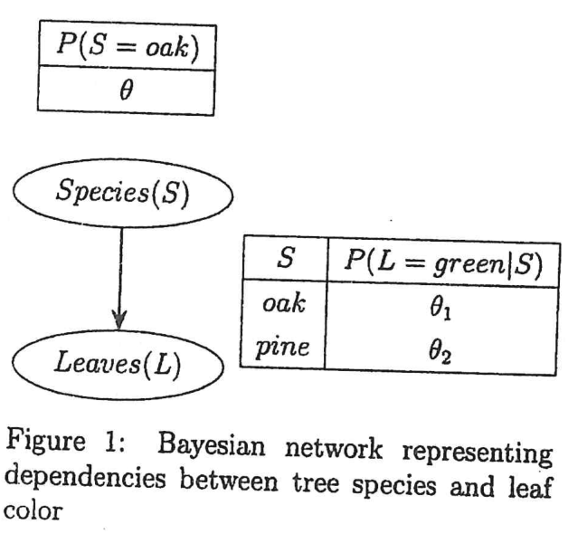

A biologist is conducting a survey in a national park to study the distribution of tree species and their leaf colors. Each observed tree is categorized based on:

- Its species: oak or pine
- Its leaf color: green or yellow

The observed data (Table 1: Observed Tree Count) and the Bayesian network of dependency (Figure 1) are shown below.

| Species | Leaves: Green | Leaves: Yellow |
|:--|:-:|:-:|
| Oak | 30 | 20 |
| Pine | 25 | 15 |

Define the following observed count variables:

- $g_o$: number of green-leaved oak trees
- $y_o$: number of yellow-leaved oak trees
- $g_p$: number of green-leaved pine trees
- $y_p$: number of yellow-leaved pine trees
- $n_o$: total number of oak trees
- $n_p$: total number of pine trees

The observed data and the Bayesian network of dependency have been presented in table 1 and figure 1, respectively.

(i) Write the expression for the log-likelihood of the observed data as a function of the model parameters $\theta$, $\theta_1$, and $\theta_2$, and the observed counts $g_o$, $y_o$, $g_p$, $y_p$, $n_o$ and $n_p$. Use base 10 logarithms.

(ii) Derive the values of $\theta$, $\theta_1$, and $\theta_2$ that maximize the log-likelihood in terms of the count variables.

(iii) Compute the numerical estimates of $\theta$, $\theta_1$, and $\theta_2$ using the observed data in table 1.
