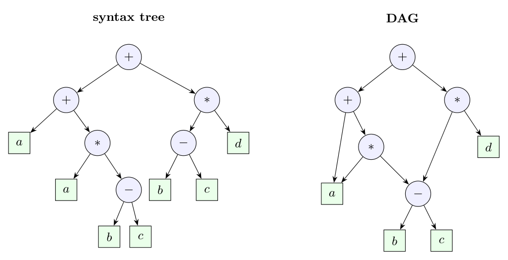

**(i) Syntax-directed definition (SDD) and syntax-directed translation (SDT).**

| | SDD | SDT |
|:--|:--|:--|
| What it is | a context-free grammar with **attributes** and **semantic rules** attached to the productions | a context-free grammar with **semantic actions** (program fragments in braces) **embedded in the production bodies** |
| Order of evaluation | **not specified**: the rules only state dependencies, the order is found from the dependency graph | **specified**: each action runs at the position where it appears, in left-to-right order |
| Level | a high-level specification | an implementation-oriented description |

Example. SDD: $E \to E_1 + T$ with the rule $E.val = E_1.val + T.val$ (no order). SDT: $E \to E_1 + T\ \{ print('+') \}$, printing `+` after the operands have been translated, giving the postfix form.

**(ii) Static and dynamic storage allocation.**

| | Static | Dynamic |
|:--|:--|:--|
| Decided | at **compile time** | at **run time** |
| Requirement | the size and lifetime of every datum are known | sizes or lifetimes are not known in advance |
| Where | fixed (static) data area | **stack** (activation records, local variables) and **heap** (`malloc`, `new`) |
| Recursion | not allowed (one frame per procedure) | supported |
| Example | global/`static` variables in C, all variables in Fortran 77 | local variables of recursive functions; `p = malloc(n)` |

**(iii) Syntax tree and DAG.** A syntax tree has a node for every operator and operand occurrence; a **directed acyclic graph** (DAG) shares one node for identical sub-expressions, so a common sub-expression is represented and evaluated once. For $a + a * (b - c) + (b - c) * d$ the tree has two copies of $b - c$ (and two $a$'s, two $b$'s, two $c$'s), while the DAG has one:

**(iv) S-attributed and L-attributed definitions.** In an **S-attributed** SDD all attributes are **synthesized**, so values flow from children to parent and the rules can be evaluated bottom-up (e.g. by an LR parser): $E \to E_1 + T$, $E.val = E_1.val + T.val$. An **L-attributed** SDD also allows **inherited** attributes, provided each inherited attribute of a body symbol depends only on the inherited attributes of the head and on attributes of symbols **to its left**; it can be evaluated in one left-to-right depth-first pass: $T \to F\,T'$, $T'.inh = F.val$. Every S-attributed definition is L-attributed, but not conversely.
