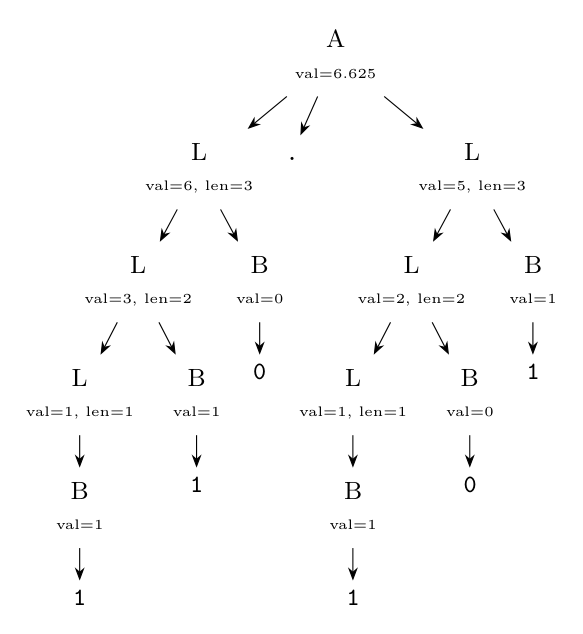
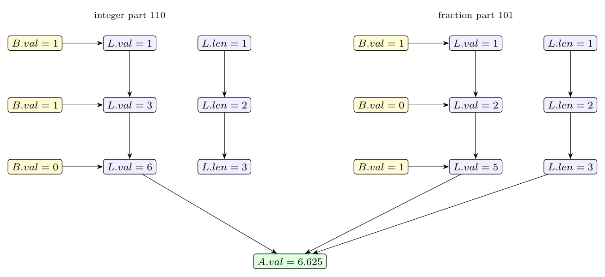

Grammar: $A \to L . L \mid L$, $L \to L B \mid B$, $B \to 0 \mid 1$.

**(i) SDT.** The integer part is evaluated left to right: appending a bit $b$ to a binary number $v$ gives $2v + b$. The fraction part digits have negative weights, so its value is the integer value of the bits divided by $2^n$, where $n$ is the number of fraction bits. So $L$ needs two **synthesized** attributes, $L.val$ and $L.len$ (the number of bits). All attributes are synthesized, so the actions are at the right end of the productions (a *postfix* SDT, executed when the production is reduced):

$$A \to L_1 . L_2\ \{\ A.val = L_1.val + L_2.val / 2^{L_2.len}\ \}$$

$$A \to L\ \{\ A.val = L.val\ \}$$

$$L \to L_1\ B\ \{\ L.val = 2 \times L_1.val + B.val;\ L.len = L_1.len + 1\ \}$$

$$L \to B\ \{\ L.val = B.val;\ L.len = 1\ \}$$

$$B \to 0\ \{\ B.val = 0\ \}$$

$$B \to 1\ \{\ B.val = 1\ \}$$

**(ii) The string $110.101$.** Integer part $110$: $L.val$ takes the values $1, 3, 6$ and $L.len$ the values $1, 2, 3$. Fraction part $101$: $L.val$ takes $1, 2, 5$ and $L.len$ $1, 2, 3$. Then $A.val = 6 + 5/2^3 = 6 + 0.625 = \mathbf{6.625}$.

**Annotated parse tree:**

**Dependency graph** (an edge $u \to v$ means $v$ is computed from $u$; yellow: values of the digits, blue: the attributes of $L$):

A topological order is: all $B.val$ and the first $L.len$, then $L.val$ and $L.len$ level by level from the innermost $L$ upwards in both parts, and finally $A.val$ (which needs $L.val$ of the integer part and $L.val$ and $L.len$ of the fraction part).

*Check:* $110_2 = 6$, $101_2 / 2^3 = 5/8$; $6 + 5/8 = 6.625$, which agrees with the required translation.
