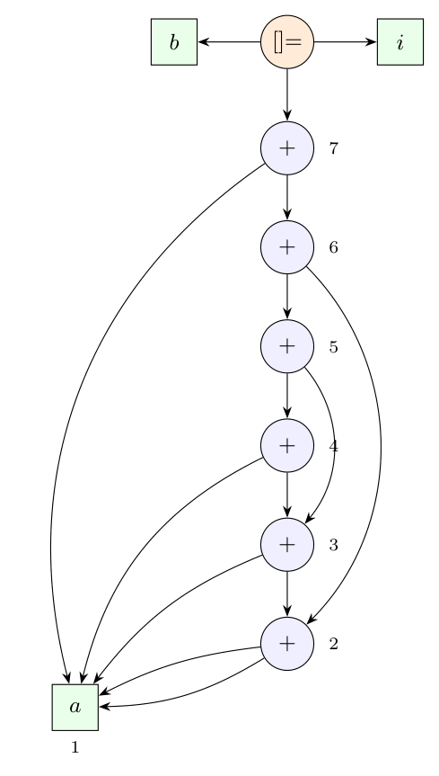

Expression: $b[i] = a + (a + a + (a + a + a + (a + a + a + a)))$. With left associativity inside each bracket:

- $R = a + a + a + a = ((a + a) + a) + a$;
- $Q = a + a + a + R = ((a + a) + a) + R$;
- $P = a + a + Q = (a + a) + Q$;
- whole right side $= a + P$.

**Value-number construction** (Dragon book sec. 6.1.2): each `(op, left, right)` is searched in the table before a node is created.

| Number | Node | Left | Right | How it arises |
|:-:|:--|:-:|:-:|:--|
| 1 | leaf $a$ | | | |
| 2 | $+$ | 1 | 1 | $a + a$ (first occurrence) |
| 3 | $+$ | 2 | 1 | $(a + a) + a$ |
| 4 | $+$ | 3 | 1 | $((a + a) + a) + a = R$ |
| 5 | $+$ | 3 | 4 | $((a + a) + a) + R = Q$; the node 3 is **reused** |
| 6 | $+$ | 2 | 5 | $(a + a) + Q = P$; the node 2 is **reused** |
| 7 | $+$ | 1 | 6 | $a + P$ |

The assignment to the array element is the node `[]=` with the three children $b$, $i$ and node 7.

The sub-expressions $a + a$ (node 2) and $(a + a) + a$ (node 3) occur several times in the expression but exist once in the DAG, and the leaf $a$ has a single node with many parents. The syntax tree would need 10 leaves $a$ and 9 `+` nodes; the DAG needs 1 leaf $a$ and 6 `+` nodes.

*Check:* the value-number table was produced by a script and agrees with the table (6 operator nodes).
