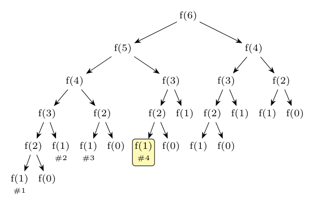

For $n < 2$ the function returns 1, so $f(0) = f(1) = 1$, $f(2) = 2$, $f(3) = 3$, $f(4) = 5$, $f(5) = 8$, $f(6) = 13$. Each call $f(n)$ with $n \ge 2$ calls first $f(n-1)$ (to compute `s`) and then $f(n-2)$ (for `t`).

**(i) Activation tree of $f(6)$.** Every node is a call, its children are the calls it makes, in the order they happen. There are **25 calls** in all. The calls of `f(1)` are numbered in the order of occurrence (the fourth is highlighted):

**(ii) Control stack when the fourth call of $f(1)$ is about to return.** The active calls are the ones on the path from the root to this node: $f(6) \to f(5) \to f(3) \to f(2) \to f(1)$. The fourth $f(1)$ is the first child of the $f(2)$ that is the first child of the $f(3)$ that is the *second* child of $f(5)$; so $f(4)$ (the first child of $f(5)$) has already returned. Only the argument and the return value are shown (the return values of the calls that have not finished are not yet known):

| Record (bottom to top) | Argument $n$ | Return value |
|:--|:-:|:-:|
| $f(6)$ | 6 | not yet computed |
| $f(5)$ | 5 | not yet computed |
| $f(3)$ | 3 | not yet computed |
| $f(2)$ | 2 | not yet computed |
| $f(1)$ (top) | 1 | **1** |

*Check:* the call tree was generated by a script: 25 calls; the first six calls of `f(1)` have the active stacks (6,5,4,3,2,1), (6,5,4,3,1), (6,5,4,2,1), (6,5,3,2,1), (6,5,3,1), (6,4,3,2,1); the fourth is (6,5,3,2,1).
