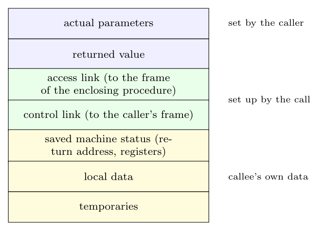

A general **activation record** (frame) is the block of memory used for one execution of a procedure. It has the following fields (Dragon book sec. 7.3.2), from the end of the caller's frame towards the callee's:

| Field | Purpose |
|:--|:--|
| **Actual parameters** | the arguments passed by the caller; often placed in registers instead for speed |
| **Returned value** | space for the value the callee returns to the caller (often a register is used instead) |
| **Access link** | pointer to the frame of the procedure in which this one is declared (static parent), used to reach **non-local data** in languages with nested procedures |
| **Control link** | pointer to the activation record of the **caller**, so the stack can be popped and the caller's frame restored on return |
| **Saved machine status** | the state of the machine before the call: the **return address** (value of the program counter) and the contents of the **registers** the callee uses, which are restored on return |
| **Local data** | the local variables of the procedure |
| **Temporaries** | temporary values created in evaluating expressions (those not held in registers) |

The record is pushed on the control stack when the procedure is called and popped when it returns; its size is known at compile time except for variable-length data.
