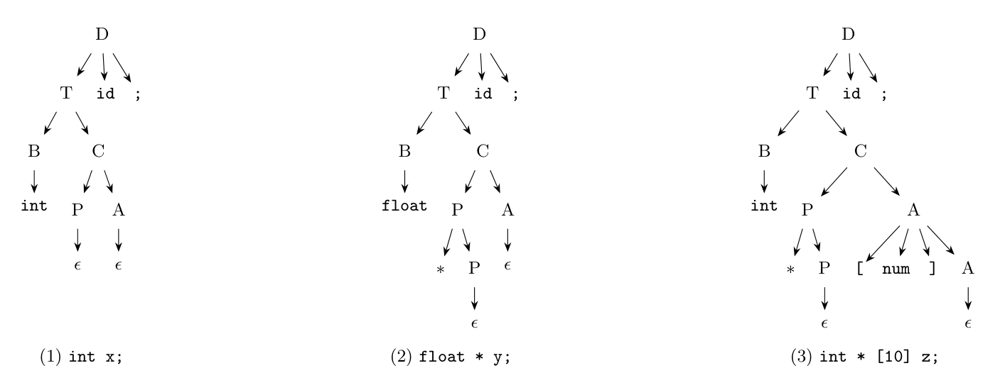

Grammar: $D \to T\ \textbf{id}\ ;$, $T \to B\,C$, $B \to \textbf{int} \mid \textbf{float}$, $C \to P\,A$, $P \to *\,P \mid \epsilon$, $A \to [\textbf{num}]\,A \mid \epsilon$. So $C$ describes the type constructors after the basic type: the pointers $P$ first, then the array dimensions $A$.

**(i) Parse trees.**



(1) `int x;`: $B \to \textbf{int}$, $C \to P A$ with $P \to \epsilon$, $A \to \epsilon$. (2) `float * y;`: $B \to \textbf{float}$, $P \to *\,P$ with the inner $P \to \epsilon$. (3) `int * [10] z;`: $B \to \textbf{int}$, $P \to *\,P$, and $A \to [\textbf{num}]\,A$ with the inner $A \to \epsilon$ ($\textbf{num} = 10$).

**(ii) SDD (as an SDT) for the type and width.** The base type and width travel *down* to the empty productions as inherited attributes ($t$, $w$ in the style of Dragon book Fig. 6.15), and the final type and width come back *up* as synthesized attributes. **Assumption:** the width of a pointer is 4 bytes (not given in the question); $\text{int}$ is 4 and $\text{float}$ is 8.

```text
D -> T id ;      { top.put(id.lexeme, T.type, offset); offset = offset + T.width }
T -> B           { C.t = B.type; C.w = B.width }
                 C   { T.type = C.type; T.width = C.width }
B -> int         { B.type = integer; B.width = 4 }
B -> float       { B.type = float;   B.width = 8 }
C ->             { P.t = C.t; P.w = C.w }
                 P   { A.t = P.type; A.w = P.width }
                 A   { C.type = A.type; C.width = A.width }
P -> *           { P1.t = pointer(P.t); P1.w = 4 }
                 P1  { P.type = P1.type; P.width = P1.width }
P -> eps         { P.type = P.t; P.width = P.w }
A -> [ num ]     { A1.t = A.t; A1.w = A.w }
                 A1  { A.type = array(num.value, A1.type); A.width = num.value * A1.width }
A -> eps         { A.type = A.t; A.width = A.w }
```

**Results for the three declarations:**

| Declaration | $T.type$ | $T.width$ |
|:--|:--|:-:|
| `int x;` | $integer$ | 4 |
| `float * y;` | $pointer(float)$ | 4 |
| `int * [10] z;` | $array(10, pointer(integer))$ | $10 \times 4 = 40$ |

For `int * [10] z;`: $B$ gives $integer$, 4; $P \to *P_1$ makes $P_1.t = pointer(integer)$ with width 4; $P_1 \to \epsilon$ returns it, so $A.t = pointer(integer)$, $A.w = 4$; $A \to [10]\,A_1$ gives $array(10, pointer(integer))$ with width $10 \times 4 = 40$.
