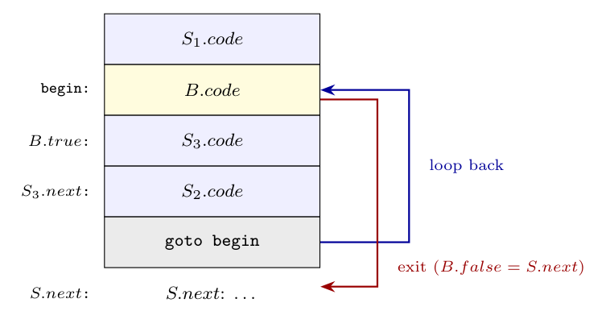

For $S \to \textbf{for}\ (S_1\ ;\ B\ ;\ S_2)\ S_3$ the initialisation $S_1$ is executed once, the condition $B$ is tested before every iteration, the body $S_3$ is executed, then the step $S_2$, and control returns to the test. $B.code$ is jumping code: it jumps to $B.true$ when $B$ holds and to $B.false$ when not.

**Code structure layout:**



```text
        S1.code                      ; initialisation
begin:  B.code                       ; jumps to B.true if B is true, else to B.false (= S.next)
B.true: S3.code                      ; loop body
S3.next:S2.code                      ; step
        goto begin                   ; repeat the test
S.next: ...                          ; the code after the statement
```

**Labels** (inherited attribute $S.next$ is the label of the code after the statement):

```text
begin   = newlabel()
S1.next = begin
B.true  = newlabel()
B.false = S.next
S3.next = newlabel()
S2.next = begin
S.code  = S1.code || label(begin) || B.code || label(B.true) || S3.code
          || label(S3.next) || S2.code || gen('goto' begin)
```

($||$ is concatenation.) $S_1$ falls through into the test, the end of the body $S_3$ falls through to the step $S_2$ ($S_3.next$ labels the start of $S_2$), and the last `goto` sends control back to the test; when $B$ is false the loop is left through $B.false = S.next$.
