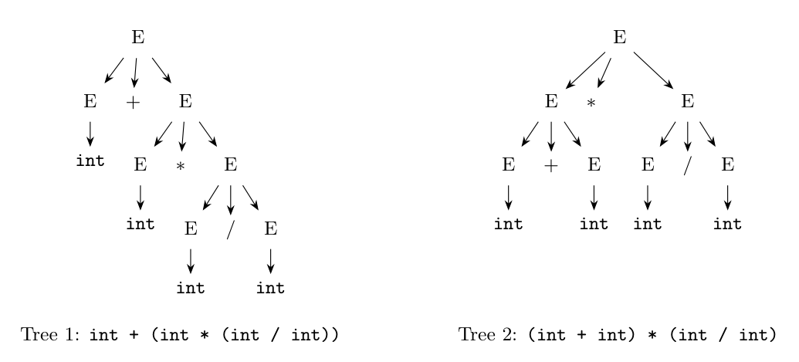

Grammar: $E \to E + E \mid E - E \mid E * E \mid E / E \mid \textbf{int}$. String: `int + int * int / int`.

**Leftmost derivation 1** (the first step uses $E \to E + E$, so `+` is at the root):

```text
E => E + E
  => int + E
  => int + E * E
  => int + int * E
  => int + int * E / E
  => int + int * int / E
  => int + int * int / int
```

**Leftmost derivation 2** (the first step uses $E \to E * E$, so `*` is at the root):

```text
E => E * E
  => E + E * E
  => int + E * E
  => int + int * E
  => int + int * E / E
  => int + int * int / E
  => int + int * int / int
```

(In the second derivation the left $E$ of $E * E$ is expanded as $E + E$, and the right $E$ later becomes $E / E$.)

**Parse trees:**



Tree 1 groups the string as $\textbf{int} + (\textbf{int} * (\textbf{int} / \textbf{int}))$ and tree 2 as $(\textbf{int} + \textbf{int}) * (\textbf{int} / \textbf{int})$; with four binary operators the string has more such trees.

**What does this tell us?** The same string has **two different parse trees (and leftmost derivations)**, so the grammar is **ambiguous**. It does not say which operator has higher precedence or how operators of the same precedence associate; the two trees give different values (for example with 1, 2, 3, 4 for the ints: $1 + (2 \cdot (3/4))$ versus $(1+2) \cdot (3/4)$). Such a grammar is unsuitable for a compiler unless the ambiguity is removed by rewriting it (sec. 4.3.2) with one nonterminal per precedence level and left recursion for left associativity, or resolved by precedence and associativity declarations in the parser generator.
