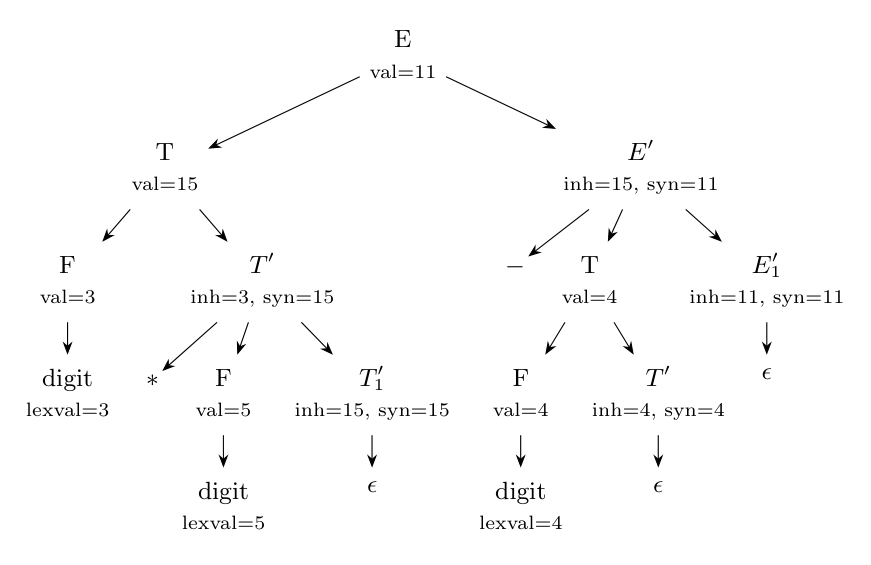

**(i) Extending the CFG.** The given grammar is $E \to TE'$, $E' \to +TE' \mid \epsilon$, $T \to \textbf{digit}$ (left-recursion free, for top-down parsing). To add $-$ and $*$ with their usual precedence and left associativity, add a new level for products:

$$E \to T\,E'$$

$$E' \to +\,T\,E' \mid -\,T\,E' \mid \epsilon$$

$$T \to F\,T'$$

$$T' \to *\,F\,T' \mid \epsilon$$

$$F \to \textbf{digit}$$

($E'$ handles sums and differences and $T'$ products, with the same left-recursion-free scheme.)

**(ii) The SDD.** The value of the left part is passed to the right in the inherited attributes $E'.inh$, $T'.inh$; the final value comes back in the synthesized attributes $E'.syn$, $T'.syn$.

| Production | Semantic rules |
|:--|:--|
| $E \to T\ E'$ | $E'.inh = T.val$ |
| | $E.val = E'.syn$ |
| $E' \to +\ T\ E_1'$ | $E_1'.inh = E'.inh + T.val$ |
| | $E'.syn = E_1'.syn$ |
| $E' \to -\ T\ E_1'$ | $E_1'.inh = E'.inh - T.val$ |
| | $E'.syn = E_1'.syn$ |
| $E' \to \epsilon$ | $E'.syn = E'.inh$ |
| $T \to F\ T'$ | $T'.inh = F.val$ |
| | $T.val = T'.syn$ |
| $T' \to *\ F\ T_1'$ | $T_1'.inh = T'.inh \times F.val$ |
| | $T'.syn = T_1'.syn$ |
| $T' \to \epsilon$ | $T'.syn = T'.inh$ |
| $F \to \textbf{digit}$ | $F.val = \textbf{digit}.lexval$ |

**(iii) Annotated parse tree for `3*5-4`** (value $3 \times 5 - 4 = 11$):

Computation: $F.val = 3$, so $T'.inh = 3$; $T' \to *F\,T_1'$ with $F.val = 5$: $T_1'.inh = 15$, $T_1'.syn = 15$, hence $T'.syn = 15$ and $T.val = 15$ (the first term). Then $E'.inh = T.val = 15$; $E' \to -T\,E_1'$ with $T.val = 4$ (from $F.val = 4$, $T'.inh = 4$, $T'.syn = 4$): $E_1'.inh = 15 - 4 = 11$; $E_1' \to \epsilon$: $E_1'.syn = 11$, so $E'.syn = 11$ and $E.val = \mathbf{11}$.

**(iv) The SDT.** The SDD is L-attributed, so it is converted with the rule: the action computing an inherited attribute of a nonterminal goes immediately **before** it, and the action computing a synthesized attribute of the head goes at the **end** of the production (Dragon book sec. 5.4.5).

$$E \to T\ \{E'.inh = T.val\}\ E'\ \{E.val = E'.syn\}$$

$$E' \to +\ T\ \{E_1'.inh = E'.inh + T.val\}\ E_1'\ \{E'.syn = E_1'.syn\}$$

$$E' \to -\ T\ \{E_1'.inh = E'.inh - T.val\}\ E_1'\ \{E'.syn = E_1'.syn\}$$

$$E' \to \epsilon\ \{E'.syn = E'.inh\}$$

$$T \to F\ \{T'.inh = F.val\}\ T'\ \{T.val = T'.syn\}$$

$$T' \to *\ F\ \{T_1'.inh = T'.inh \times F.val\}\ T_1'\ \{T'.syn = T_1'.syn\}$$

$$T' \to \epsilon\ \{T'.syn = T'.inh\}$$

$$F \to \textbf{digit}\ \{F.val = \textbf{digit}.lexval\}$$
