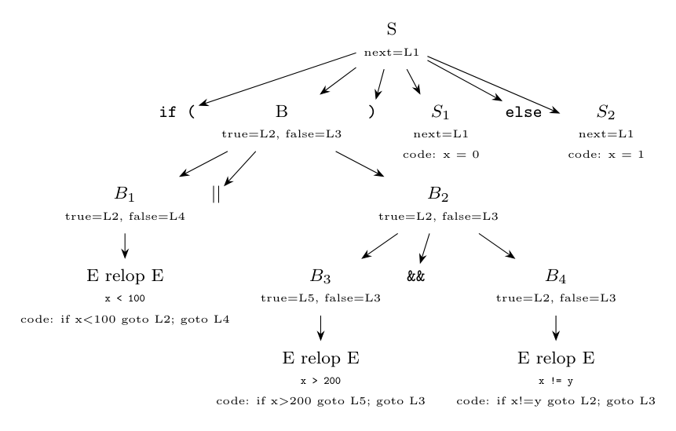

**(i) SDD generating three-address code for the control-flow statements.** Labels are *inherited* attributes: $S.next$ for statements, $B.true$ and $B.false$ for booleans. $B.code$ is jumping code (it always ends by jumping to $B.true$ or $B.false$). $/\!/$ is concatenation.

| Production | Semantic rules |
|:--|:--|
| $P \to S$ | $S.next = newlabel()$ |
| | $P.code = S.code\ /\!/\ label(S.next)$ |
| $S \to \textbf{id} = \textbf{num};$ | $S.code = gen(\textbf{id}.lexeme\ \text{'='}\ \textbf{num}.value)$ |
| $S \to \textbf{if}\ (B)\ S_1\ \textbf{else}\ S_2$ | $B.true = newlabel()$ |
| | $B.false = newlabel()$ |
| | $S_1.next = S.next$ |
| | $S_2.next = S.next$ |
| | $S.code = B.code\ /\!/\ label(B.true)\ /\!/\ S_1.code$ |
| | $\quad /\!/\ gen(\text{'goto'}\ S.next)\ /\!/\ label(B.false)\ /\!/\ S_2.code$ |
| $B \to B_1\ \vert\vert\ B_2$ | $B_1.true = B.true$ |
| | $B_1.false = newlabel()$ |
| | $B_2.true = B.true$ |
| | $B_2.false = B.false$ |
| | $B.code = B_1.code\ /\!/\ label(B_1.false)\ /\!/\ B_2.code$ |
| $B \to B_1\ \&\&\ B_2$ | $B_1.true = newlabel()$ |
| | $B_1.false = B.false$ |
| | $B_2.true = B.true$ |
| | $B_2.false = B.false$ |
| | $B.code = B_1.code\ /\!/\ label(B_1.true)\ /\!/\ B_2.code$ |
| $B \to E_1\ \textbf{relop}\ E_2$ | $B.code = E_1.code\ /\!/\ E_2.code$ |
| | $\quad /\!/\ gen(\text{'if'}\ E_1.addr\ \textbf{relop}.op\ E_2.addr\ \text{'goto'}\ B.true)$ |
| | $\quad /\!/\ gen(\text{'goto'}\ B.false)$ |
| $E \to \textbf{id}$ | $E.addr = top.get(\textbf{id}.lexeme)$, $E.code = \text{''}$ |
| $E \to \textbf{num}$ | $E.addr = \textbf{num}.value$, $E.code = \text{''}$ |

**(ii) Annotated parse tree for `if (x < 100 || x > 200 && x != y) x = 0; else x = 1;`.** Since `&&` has higher precedence than `||`, the condition is $B_1 \,||\, (B_3 \,\&\&\, B_4)$ with $B_1$ = `x < 100`, $B_3$ = `x > 200`, $B_4$ = `x != y`. The labels are created in this order: $S.next = L1$ (from $P \to S$), then $B.true = L2$, $B.false = L3$, then $B_1.false = L4$ (for `||`), then $B_3.true = L5$ (for `&&`).



Resulting code of the leaves: $B_1$: `if x < 100 goto L2`, `goto L4`; $B_3$: `if x > 200 goto L5`, `goto L3`; $B_4$: `if x != y goto L2`, `goto L3`. Putting the codes together:

```text
        if x < 100 goto L2        // B1.code
        goto L4
L4:     if x > 200 goto L5        // B2.code = B3.code, label L5, B4.code
        goto L3
L5:     if x != y goto L2
        goto L3
L2:     x = 0                      // S1.code
        goto L1
L3:     x = 1                      // S2.code
L1:
```

*Check:* the label allocation and the code were produced by a script that applies the rules of the SDD in the order of the parse; it printed exactly this code.
