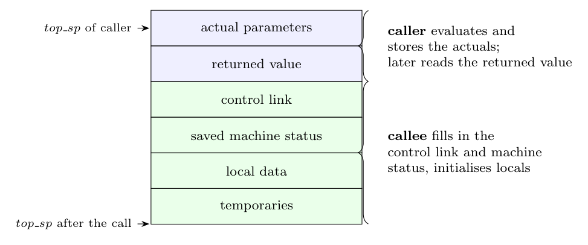

A call of a function is implemented by a **calling sequence** (code before and at the start of the call) and a **return sequence** (code at the end), split between the **caller** and the **callee** (Dragon book sec. 7.3.3). Parts of the sequences that depend only on the language (such as evaluating the arguments) are done in the caller; parts that depend on the callee (local data size, registers it uses) are done in the callee, so they are generated once, with the function, not at every call site.

**Calling sequence.**

| Done by the **caller** | Done by the **callee** |
|:--|:--|
| 1. Evaluate the **actual parameters** and place them in the callee's frame (or registers). | 3. **Save the register values** and other machine status. |
| 2. Store the **return address** and the old value of `top_sp` (control link) in the callee's frame; increase `top_sp` to the callee's frame. | 4. **Initialise local data** and begin execution (the body of the function). |
| Branch to the callee's code. | |

**Return sequence.**

| Done by the **callee** | Done by the **caller** |
|:--|:--|
| 1. Place the **return value** next to the parameters. | 3. **Copy** (use) the **returned value** from the callee's former frame. |
| 2. **Restore** the registers and `top_sp`, pop the frame, and **branch to the return address**. | |

**Why this split.** The caller knows the actual arguments and what it wants to do with the result; the callee knows its own frame size and registers. The callee may be called from many places, so the code that only the callee can prepare is kept in the callee, and the caller's code before and after the call stays short. The size of the caller's temporaries is known to the caller, and the size of the callee's local data and temporaries to the callee.
