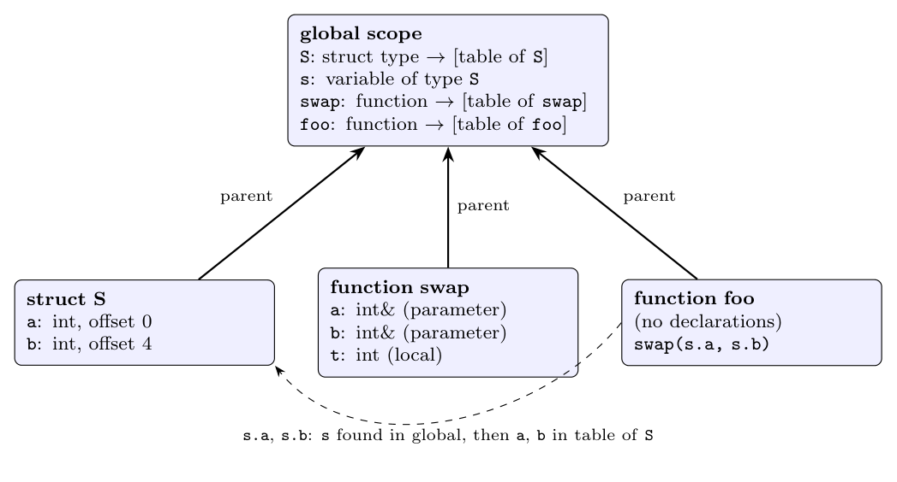

Use one symbol table per scope; each table has a pointer to the table of the enclosing scope (the *parent*), and names are looked up from the innermost table outwards (Dragon book sec. 2.7.1). A `struct` has its own table for its members.

```cpp
struct S { int a; int b; } s;      // global: S (type), s (variable)
void swap(int& a, int& b) { int t; ... }   // swap: its own scope with a, b, t
void foo() { ... swap(s.a, s.b); ... }     // foo: its own (empty) scope
```

**Symbol table structure:**



| Table | Entries | Parent |
|:--|:--|:--|
| global | `S`: struct type (pointer to table of `S`); `s`: variable of type `S`; `swap`: function; `foo`: function | none |
| struct `S` | `a`: `int`, offset 0; `b`: `int`, offset 4 | global |
| function `swap` | `a`: `int&` (parameter); `b`: `int&` (parameter); `t`: `int` (local) | global |
| function `foo` | none | global |

**Scope effects.** Inside `swap`, `a` and `b` are the *reference parameters*; they hide nothing global (the struct members `S.a` and `S.b` are in the table of `S`, not in the global table, so they are not visible as plain `a`, `b`). In `foo`, the call `swap(s.a, s.b)` looks up `s` in the table of `foo` (not found) and then in the global table (found, type `S`); then `.a` and `.b` are looked up in the table belonging to type `S`. `swap` is found in the global table, and its parameters are two `int&`, matched with the two `int` fields.
