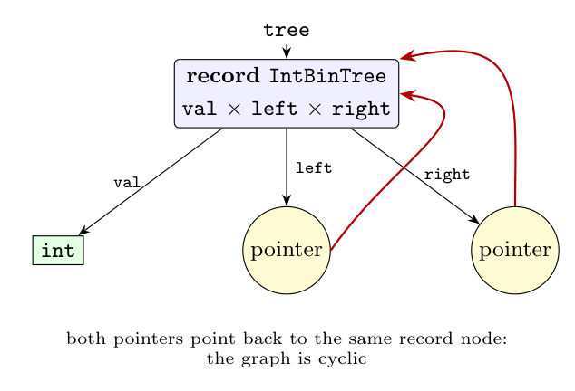

A compiler represents a type expression as a **type graph**: an interior node for each type constructor (record, pointer, array, function) and a leaf for each basic type. A *recursive* type (a record containing pointers to itself) makes the graph **cyclic**; instead of an infinite tree, the pointer node refers back to the node of the record (Dragon book sec. 6.3.1-6.3.2).

For

```c
struct IntBinTree {
    int val;
    struct IntBinTree *left;
    struct IntBinTree *right;
} tree;
```

the type of `tree` is the record with three fields: `val` of type `int`, `left` and `right` of type *pointer to* `struct IntBinTree`. Both pointer nodes point **back to the record node**:



In the notation of type expressions:

$$\text{record}\big((val \times int) \times (left \times pointer(\text{IntBinTree})) \times (right \times pointer(\text{IntBinTree}))\big)$$

The occurrences of $\text{IntBinTree}$ inside are not copied but are edges back to the record node, which is what makes the graph cyclic. Because of this cycle, a test for structural equivalence of recursive types must avoid infinite loops (by assuming that a pair of nodes being compared is equal).
