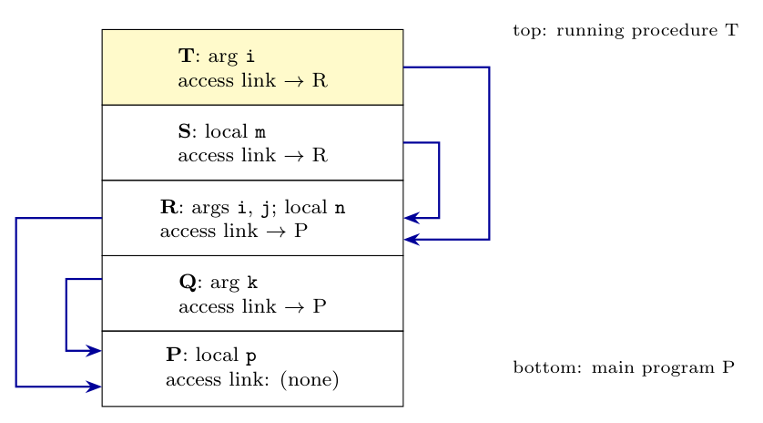

**Nesting.** $P$ is at nesting depth 1. $Q$ and $R$ are declared inside $P$ (depth 2); $T$ and $S$ are declared inside $R$ (depth 3). The **access link** of an activation of a procedure $X$ points to the activation record of the **procedure in which $X$ is declared**, found by following the caller's access links (Dragon book sec. 7.4.5):

- $P$ calls $Q$: $Q$ is declared in $P$, which is the caller, so $Q$'s access link $\to$ $P$.
- $Q$ calls $R$: $R$ is declared in $P$ (not in $Q$): from the caller $Q$ follow one access link, to $P$. So $R$'s access link $\to$ $P$.
- $R$ calls $S$: $S$ is declared in $R$, the caller: $S$'s access link $\to$ $R$.
- $S$ calls $T$: $T$ is declared in $R$, not in $S$: from $S$ follow one access link, to $R$. So $T$'s access link $\to$ $R$.

**(i) Stack layout** (top of stack is $T$), arguments and local variables in each record:

| Record (bottom to top) | Arguments | Locals | Access link |
|:--|:--|:--|:--|
| $P$ | none | `p` | none |
| $Q$ | `k` | none | $\to P$ |
| $R$ | `i`, `j` | `n` | $\to P$ |
| $S$ | none | `m` | $\to R$ |
| $T$ | `i` | none | $\to R$ |

**(ii) Visible variables in the body of $T$.** Static scope: look in $T$, then in the procedures that textually enclose it ($R$, then $P$); the variables of $Q$ and $S$ are in unrelated scopes (siblings), so they are not visible.

| Var | visible (Y/N) | # links | Explanation |
|:-:|:-:|:-:|:--|
| `i` | Y | 0 | $T$'s own parameter (hides $R$'s `i`) |
| `j` | Y | 1 | parameter of $R$, one link ($T \to R$) |
| `k` | N | | belongs to $Q$, not an enclosing scope of $T$ |
| `m` | N | | local of $S$, a sibling procedure of $T$ |
| `n` | Y | 1 | local of $R$, one link |
| `p` | Y | 2 | local of $P$, two links ($T \to R \to P$) |
