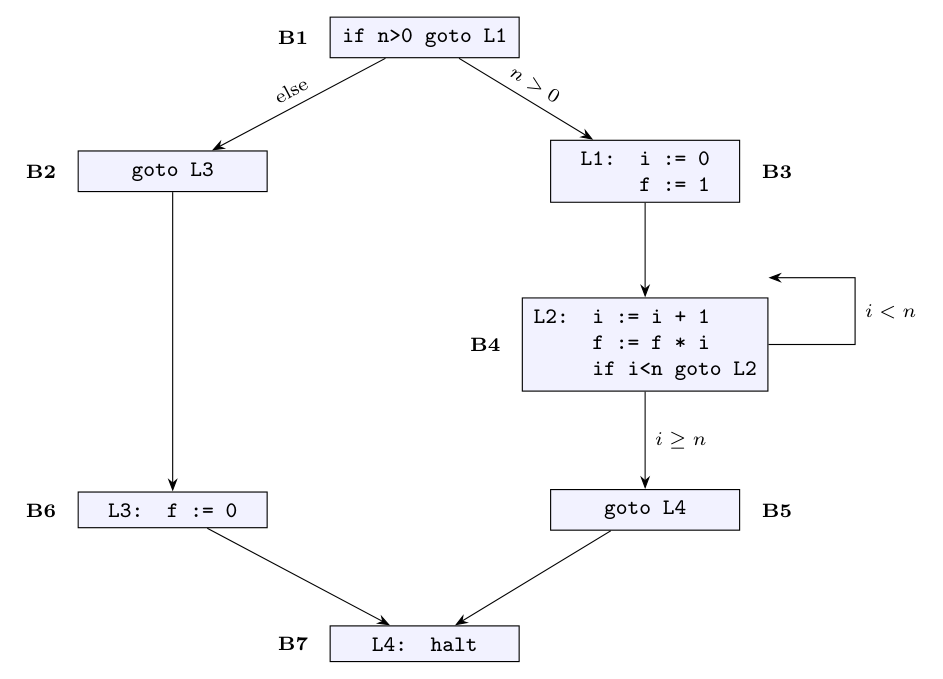

Number the instructions 1 to 10:

```text
 1        if n>0 goto L1
 2        goto L3
 3  L1:   i := 0
 4        f := 1
 5  L2:   i := i + 1
 6        f := f * i
 7        if i<n goto L2
 8        goto L4
 9  L3:   f := 0
10  L4:   halt
```

**Leaders** (Algorithm 8.5): the first instruction (1); the target of every jump: L1 (3), L2 (5), L3 (9), L4 (10); the instruction following a jump: after 1 is 2, after 2 is 3, after 7 is 8, after 8 is 9.

Leaders: **1, 2, 3, 5, 8, 9, 10.** Each basic block runs from a leader to the instruction before the next leader:

| Block | Instructions |
|:-:|:--|
| $B_1$ | 1: `if n>0 goto L1` |
| $B_2$ | 2: `goto L3` |
| $B_3$ | 3-4: `L1: i := 0`, `f := 1` |
| $B_4$ | 5-7: `L2: i := i + 1`, `f := f * i`, `if i<n goto L2` |
| $B_5$ | 8: `goto L4` |
| $B_6$ | 9: `L3: f := 0` |
| $B_7$ | 10: `L4: halt` |

**Control flow graph.** Edges: a jump to its target, and a fall-through to the next block if the block does not end in an unconditional jump.

- $B_1 \to B_3$ (jump to L1 if $n > 0$) and $B_1 \to B_2$ (fall through);
- $B_2 \to B_6$ (`goto L3`);
- $B_3 \to B_4$;
- $B_4 \to B_4$ (jump to L2 when $i < n$) and $B_4 \to B_5$ (fall through);
- $B_5 \to B_7$ (`goto L4`);
- $B_6 \to B_7$.



$B_4$ is a loop; the code computes $n!$ for $n > 0$ and sets $f = 0$ otherwise.
