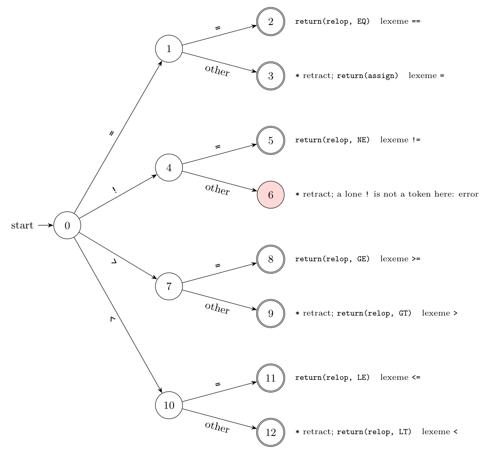

Operators: `= =`, `! =`, `=`, `>`, `<`, `>=`, `<=` (the spaces in `= =` and `! =` are only typographical; the operators are `==` and `!=`). Tokens: the six comparison operators are returned as one token **relop** with an **attribute** telling which one (EQ, NE, GT, GE, LT, LE); the single `=` is the assignment operator, token **assign**, which needs no attribute (Dragon book sec. 3.4.1, Fig. 3.13).

A **transition diagram** has states and edges labelled by characters; double circles are accepting states, and a `*` means the last character read does not belong to the lexeme, so the input pointer is **retracted** by one.

Working:

- State 0 reads the first character: `=` goes to state 1, `!` to state 4, `>` to state 7, `<` to state 10. Anything else is not the start of one of these operators.
- State 1 (`=` read): a second `=` leads to the accepting state 2, **relop EQ**, lexeme `==`; any other character leads to state 3, which **retracts** and returns the **assign** token for the lexeme `=`.
- State 4 (`!` read): `=` leads to state 5, **relop NE**, lexeme `!=`. Any other character is an error in this language (`!` alone is not an operator here); in C it would give a `!` token.
- State 7 (`>` read): `=` leads to 8, **relop GE**; otherwise state 9 retracts and returns **relop GT**.
- State 10 (`<` read): `=` leads to 11, **relop LE**; otherwise state 12 retracts and returns **relop LT**.

**Attributes** (the attribute value of the token relop is a constant naming the operator):

| Lexeme | Token | Attribute |
|:-:|:-:|:-:|
| `==` | relop | EQ |
| `!=` | relop | NE |
| `>` | relop | GT |
| `>=` | relop | GE |
| `<` | relop | LT |
| `<=` | relop | LE |
| `=` | assign | (none) |

The one-character lookahead and retraction are needed after `=`, `>` and `<`, because each of these may be the start of a longer operator.
