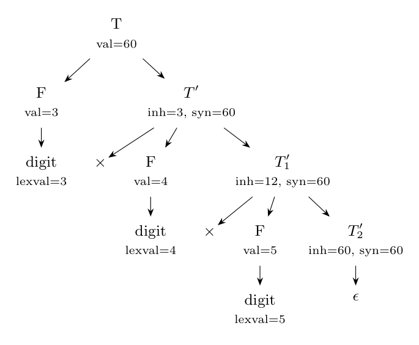

The left-recursion-free grammar for products of digits is $T \to F\,T'$, $T' \to \times F\,T_1' \mid \epsilon$, $F \to \textbf{digit}$. The partial product is passed to the right as the **inherited** attribute $T'.inh$ and the final value is returned as the **synthesized** attribute $T'.syn$ (Dragon book sec. 5.1.2).

**SDD that multiplies with inherited attributes:**

| Production | Semantic rules |
|:--|:--|
| $T \to F\ T'$ | $T'.inh = F.val$ |
| | $T.val = T'.syn$ |
| $T' \to \times F\ T_1'$ | $T_1'.inh = T'.inh \times F.val$ |
| | $T'.syn = T_1'.syn$ |
| $T' \to \epsilon$ | $T'.syn = T'.inh$ |
| $F \to \textbf{digit}$ | $F.val = \textbf{digit}.lexval$ |

**Annotated parse tree for $3 \times 4 \times 5$:**

1. $F.val$ of the three digits: 3, 4, 5.
2. $T'.inh = F.val = 3$ (inherited from the left sibling $F$).
3. $T_1'.inh = T'.inh \times F.val = 3 \times 4 = 12$.
4. $T_2'.inh = T_1'.inh \times F.val = 12 \times 5 = 60$.
5. $T_2' \to \epsilon$: $T_2'.syn = T_2'.inh = 60$; then $T_1'.syn = 60$, $T'.syn = 60$.
6. $T.val = T'.syn = 60$.

The value of $3 \times 4 \times 5$ is $\mathbf{60}$.
