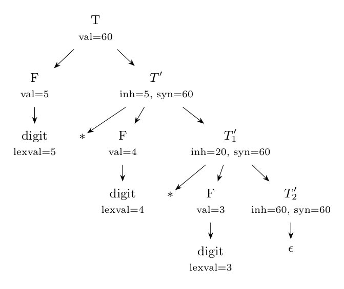

Input `5*4*3` is the token string $\textbf{digit}\,*\,\textbf{digit}\,*\,\textbf{digit}$ (the lexical values are 5, 4, 3). The parse uses $T \to F\,T'$, $T' \to *\,F\,T_1'$ (twice) and $T' \to \epsilon$.

**Evaluation order** (inherited attributes go down and to the right, synthesized go up):

1. $F.val = \textbf{digit}.lexval$: the three $F$'s have $val$ 5, 4, 3.
2. $T \to F\,T'$: $T'.inh = F.val = 5$.
3. $T' \to * F\,T_1'$: $T_1'.inh = T'.inh \times F.val = 5 \times 4 = 20$.
4. $T_1' \to * F\,T_2'$: $T_2'.inh = T_1'.inh \times F.val = 20 \times 3 = 60$.
5. $T_2' \to \epsilon$: $T_2'.syn = T_2'.inh = 60$.
6. $T_1'.syn = T_2'.syn = 60$, then $T'.syn = T_1'.syn = 60$, then $T.val = T'.syn = 60$.

**Annotated parse tree:**

The value of the expression is $T.val = \mathbf{60}$.
