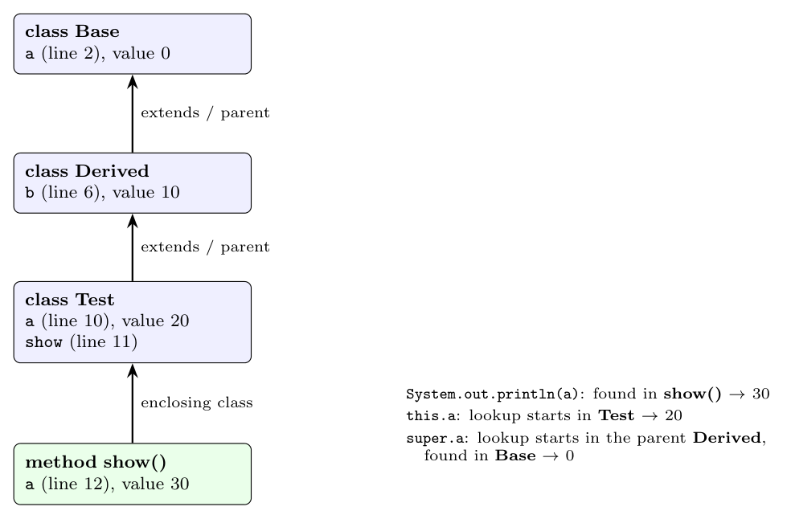

**Scope.** The *scope* of a declaration of a name $x$ is the region of the program in which a use of $x$ refers to that declaration (Dragon book sec. 1.6.3). With block structure and classes, the same name can be declared in several nested scopes; a use binds to the declaration in the **innermost** scope that encloses it (and, for classes, to the one found in the nearest superclass).

For reference, the lines of the snippet are numbered 1-17: `class Base` at 1, `a = 0` at 2; `class Derived extends Base` at 5, `b = 10` at 6; `class Test extends Derived` at 9, `a = 20` at 10, `show()` at 11, local `a = 30` at 12, and the three `println` statements at 13-15.

**Spaghetti stack of symbol tables.** One table per scope; each table points to its parent (the table searched next). For a class the parent is the superclass table, for a method it is the table of the class in which it is declared.

**Disambiguating the three prints** (each lookup starts at the indicated table and follows the parent pointers):

- `System.out.println(a)`: the lookup starts in the table of `show()`, which has `a` (30). **Output 30.**
- `System.out.println(this.a)`: `this` is a `Test` object, so the lookup of the field `a` starts in the table of class `Test`, which has `a` (20). **Output 20.**
- `System.out.println(super.a)`: `super` means the lookup starts in the parent class `Derived`; it has no `a`, so the search continues to its parent `Base`, which has `a` (0). **Output 0.**

The three occurrences of `a` thus refer to three different declarations (lines 12, 10 and 2), which the chain of tables resolves.
