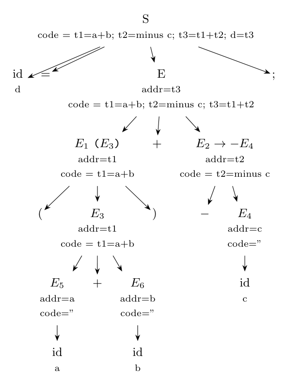

**Assumption.** The unary minus binds tighter than `+`, so the right operand is $(-c)$. Temporaries are numbered in the order that `new Temp()` is evaluated (bottom up, left to right).

**Parse.** $S \to \textbf{id}\,=\,E\,;$ with $E \to E_1 + E_2$, $E_1 \to (E_3)$, $E_3 \to E_5 + E_6$ ($a + b$), $E_2 \to -E_4$, $E_4 \to \textbf{id}_c$.

**Annotated parse tree** (attributes $addr$ and $code$):



**Evaluation:** $E_5.addr = a$, $E_6.addr = b$ (code empty); $E_3$: `new Temp()` is $t_1$, code `t1 = a + b`; $E_1 \to (E_3)$ copies both; $E_4.addr = c$; $E_2 \to -E_4$: $t_2$, code `t2 = minus c`; $E \to E_1 + E_2$: $t_3$, code = $E_1.code \parallel E_2.code \parallel$ `t3 = t1 + t2`; $S.code = E.code \parallel$ `d = t3`.

**Three-address code:**

```text
t1 = a + b
t2 = minus c
t3 = t1 + t2
d  = t3
```

**Quadruples** (op, arg1, arg2, result):

| # | op | arg1 | arg2 | result |
|:-:|:-:|:-:|:-:|:-:|
| 0 | `+` | `a` | `b` | `t1` |
| 1 | `minus` | `c` | | `t2` |
| 2 | `+` | `t1` | `t2` | `t3` |
| 3 | `=` | `t3` | | `d` |

**Triples** (op, arg1, arg2; a result is referred to by the number of the triple that computes it; no temporaries):

| # | op | arg1 | arg2 |
|:-:|:-:|:-:|:-:|
| (0) | `+` | `a` | `b` |
| (1) | `minus` | `c` | |
| (2) | `+` | `(0)` | `(1)` |
| (3) | `=` | `d` | `(2)` |
