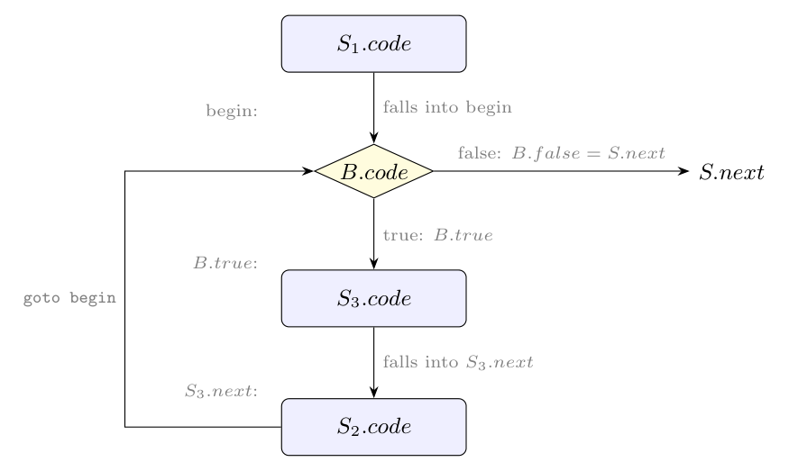

For $S \to \textbf{for}\ (S_1;\ B;\ S_2)\ S_3$ the loop runs $S_1$ once, then tests $B$ (with short-circuit **jumping code**: $B.code$ jumps to $B.true$ or $B.false$ and falls through nowhere), executes the body $S_3$ and the step $S_2$, and jumps back to the test.

**Jumping diagram:**



**Semantic rules.** $S.next$ is the inherited label of the code after the statement.

| Production | Semantic rules |
|:--|:--|
| $S \to \textbf{for}\ (S_1;\ B;\ S_2)\ S_3$ | $begin = newlabel()$ |
| | $S_1.next = begin$ |
| | $B.true = newlabel()$ |
| | $B.false = S.next$ |
| | $S_3.next = newlabel()$ |
| | $S_2.next = begin$ |
| | $S.code = S_1.code\ /\!/\ label(begin)\ /\!/\ B.code$ |
| | $\quad /\!/\ label(B.true)\ /\!/\ S_3.code$ |
| | $\quad /\!/\ label(S_3.next)\ /\!/\ S_2.code\ /\!/\ gen(\text{'goto'}\ begin)$ |

($/\!/$ is concatenation.) Explanation: $S_1$ falls into the test at $begin$ (so $S_1.next = begin$); when $B$ is true control goes to the body at $B.true$, when false it leaves the loop to $S.next$; when the body finishes (its $next$ is the label of $S_2$), $S_2$ runs and the final `goto begin` repeats the test. No jump is generated after $B.code$, since it ends with explicit jumps to $B.true$ and $B.false$.

Generated code:

```text
        S1.code
begin:  B.code            (jumps to B.true or B.false)
B.true: S3.code
S3.next: S2.code
        goto begin
S.next: ...
```
