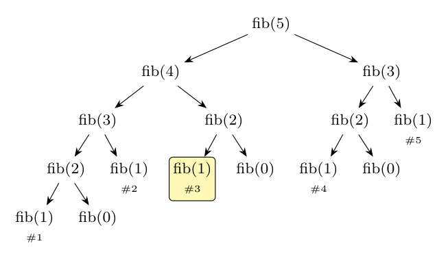
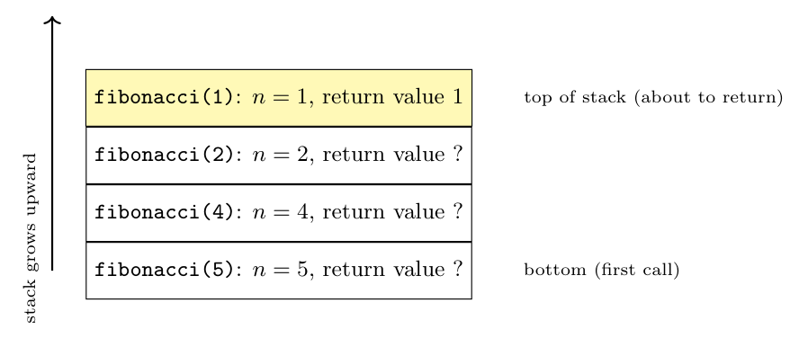

Since $n < 2$ returns 1, $fib(0) = fib(1) = 1$, $fib(2) = 2$, $fib(3) = 3$, $fib(4) = 5$, $fib(5) = 8$.

**Activation tree of `fibonacci(5)`.** Each node is one call; children are the calls it makes, left to right in the order in which they happen (a depth-first traversal gives the order of the calls). There are **15 calls**; the five calls `fibonacci(1)` are numbered in the order they occur (#3 is highlighted):

The order of the 15 calls (pre-order) is: 5, 4, 3, 2, 1, 0, 1, 2, 1, 0, 3, 2, 1, 0, 1 (the argument values).

**Control stack at the moment the third call of `fibonacci(1)` is about to return.** The calls that are active (started but not finished) are those on the path from the root to this node: `fibonacci(5)`, `fibonacci(4)`, `fibonacci(2)` and, on top, `fibonacci(1)`. Third `fibonacci(1)` is the first child of the second `fibonacci(2)` (the right child of `fibonacci(4)`), so `fibonacci(2)` has not yet received any result, and neither has `fibonacci(4)` or `fibonacci(5)` (their return values are unknown). Only the argument and the return value are shown in each activation record:

| Record (bottom to top) | Argument $n$ | Return value |
|:--|:-:|:-:|
| `fibonacci(5)` | 5 | not yet computed |
| `fibonacci(4)` | 4 | not yet computed |
| `fibonacci(2)` | 2 | not yet computed |
| `fibonacci(1)` (top) | 1 | **1** |

*Check:* the call tree was generated by a script: 15 calls; the five calls of `fibonacci(1)` have the active stacks (5,4,3,2,1), (5,4,3,1), (5,4,2,1), (5,3,2,1), (5,3,1); the third is (5,4,2,1).
