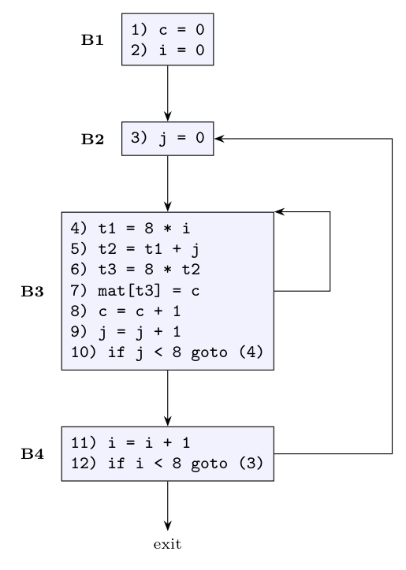

**Leaders** (Algorithm 8.5): (1) the first instruction; (2) the target of every conditional or unconditional jump; (3) every instruction that immediately follows a jump.

- Instruction 1 is the first instruction: a leader.
- Instruction 10 jumps to 4, instruction 12 jumps to 3: instructions **4** and **3** are leaders.
- The instruction after the jump 10 is **11**: a leader. (Instruction 12 is the last one.)

Leaders: **1, 3, 4, 11.** A basic block runs from a leader up to (not including) the next leader:

| Block | Instructions |
|:-:|:--|
| $B_1$ | 1, 2 (`c = 0`, `i = 0`) |
| $B_2$ | 3 (`j = 0`) |
| $B_3$ | 4 to 10 (ends with `if j < 8 goto (4)`) |
| $B_4$ | 11, 12 (ends with `if i < 8 goto (3)`) |

**Flow graph.** There is an edge $B \to C$ if $C$ can follow $B$: through a jump, or by falling through when $B$ does not end in an unconditional jump. Also add an entry (before $B_1$) and an exit.

- $B_1 \to B_2$ (fall through);
- $B_2 \to B_3$ (fall through);
- $B_3 \to B_3$ (jump to 4 when $j < 8$) and $B_3 \to B_4$ (fall through when $j \ge 8$);
- $B_4 \to B_2$ (jump to 3 when $i < 8$) and $B_4 \to$ exit (fall through).

There are two loops: $\{B_3\}$ (the inner loop over $j$) and $\{B_2, B_3, B_4\}$ (the outer loop over $i$).
