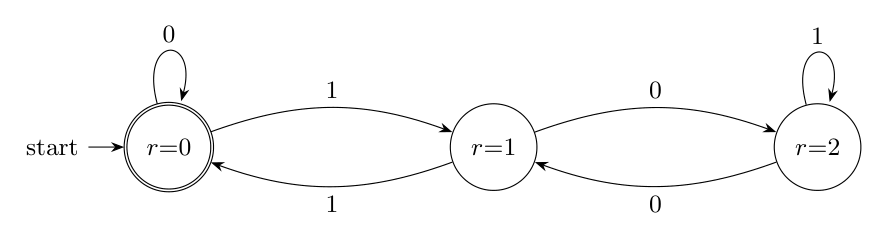

**(i) Binary strings with no consecutive 0s or 1s.** Such a string must alternate, so it is determined by its first bit and its length: $0101\ldots$ or $1010\ldots$. A regular expression:

$$1^?\,(01)^*\,0^?$$

where $x^?$ means "$x$ or nothing". Reading: an optional leading `1`, then any number of `01`, then an optional final `0`. It generates $\epsilon$, `0`, `1`, `01`, `10`, `010`, `101`, `0101`, `1010`, ... and nothing with `00` or `11` (if the empty string is to be excluded, require at least one bit). An equivalent form is $(01)^*(0 \mid \epsilon) \mid (10)^*(1 \mid \epsilon)$.

**(ii) Binary strings whose decimal value is divisible by 3.** Read the string left to right and keep the remainder $r$ of the value read so far modulo 3. Reading a bit $b$ changes the value from $v$ to $2v + b$, so the new remainder is $(2r + b) \bmod 3$:

| $r$ | on `0` | on `1` |
|:-:|:-:|:-:|
| 0 | 0 | 1 |
| 1 | 2 | 0 |
| 2 | 1 | 2 |

Start state and accepting state: $r = 0$. Eliminating states $r = 2$ and then $r = 1$ (state elimination) gives

$$\big(\,0 \;\mid\; 1\,(0\,1^*\,0)^*\,1\,\big)^*$$

Reading: from state 0 either read `0` (loop), or read `1` (go to state 1), then any number of excursions `0 1* 0` (state 1 $\to$ 2, loop on `1`, back to 1), and finally `1` to return to state 0.

*Check:* both expressions were compared with the definition on every binary string of length up to 14 (including $\epsilon$, which has value 0): they accept exactly the intended strings.
