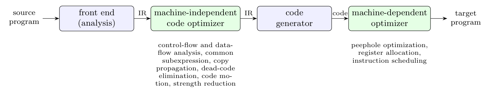

**Advantages of producing assembly language rather than machine language** (Dragon book sec. 1.1: the compiler produces an assembly-language program, which the assembler turns into relocatable machine code):

1. **Easier to generate and to debug.** Assembly language is symbolic and readable: instructions are mnemonics (`ADD R1, R2`), operands and jump targets are names and labels. The compiler writer can inspect the output and find code-generation errors much more easily than in binary.
2. **The assembler does the low-level work.** Instruction encoding, binary formats, computing the addresses of labels, relocation information and object-file formats are handled by the existing assembler, so the compiler does not need them. The compiler stays smaller and simpler.
3. **Modularity and reuse.** The assembler and linker are reused for several compilers and languages; hand-written assembly and compiled code can be mixed, and macros and directives of the assembler can be used.
4. **Portability of the compiler's back end** to different binary formats of the same instruction set, and readability for optimisation or listing (`-S` option).

The cost is an extra pass (the assembler) and a little more compile time.

**Block diagram showing the code optimization phases of a compiler:**

The *machine-independent optimizer* works on the intermediate representation (control-flow and data-flow analysis; common-subexpression elimination, copy propagation, dead-code elimination, code motion, strength reduction, inlining). After the code generator has produced target code, the *machine-dependent optimizer* improves it with knowledge of the machine: peephole optimization, register allocation and instruction scheduling.
