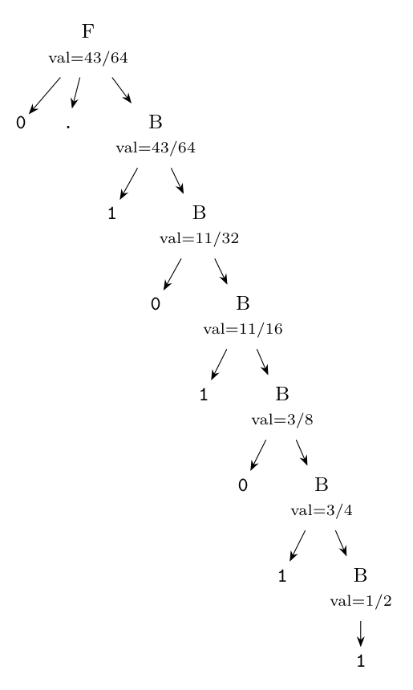
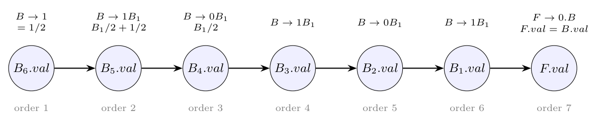

The sentence is $0.101011$. Number the $B$ nodes from the top: $B_1 \Rightarrow 1B_2$, $B_2 \Rightarrow 0B_3$, $B_3 \Rightarrow 1B_4$, $B_4 \Rightarrow 0B_5$, $B_5 \Rightarrow 1B_6$, $B_6 \Rightarrow 1$. All attributes are synthesized, so values are computed bottom-up:

| Node | Production | Rule | $val$ |
|:-:|:--|:--|:-:|
| $B_6$ | $B \to 1$ | $1/2$ | $1/2$ |
| $B_5$ | $B \to 1B_1$ | $B_6.val/2 + 1/2 = 1/4 + 1/2$ | $3/4$ |
| $B_4$ | $B \to 0B_1$ | $B_5.val/2 = 3/8$ | $3/8$ |
| $B_3$ | $B \to 1B_1$ | $3/16 + 1/2$ | $11/16$ |
| $B_2$ | $B \to 0B_1$ | $11/32$ | $11/32$ |
| $B_1$ | $B \to 1B_1$ | $11/64 + 1/2$ | $43/64$ |
| $F$ | $F \to 0.B$ | $B_1.val$ | $43/64$ |

**(i) Annotated parse tree:**

Check: $0.101011_2 = 1/2 + 1/8 + 1/32 + 1/64 = 43/64 = 0.671875$, which equals $\sum b_i 2^{-i}$.

**(ii) Dependency graph.** There is one edge for every dependency: $B_k.val$ depends on $B_{k+1}.val$, and $F.val$ depends on $B_1.val$. The graph is a chain:

**(iii) Topological order.** The graph is a single path, so exactly one topological order exists:

$$B_6.val,\ B_5.val,\ B_4.val,\ B_3.val,\ B_2.val,\ B_1.val,\ F.val$$

(the order in which the values were computed above), which is the bottom-up order of the tree; evaluating in this order, every attribute is computed after the ones it depends on.

*Check:* the values were computed with exact fractions in a script and agree with $43/64$.
