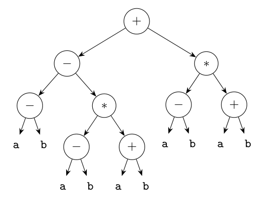
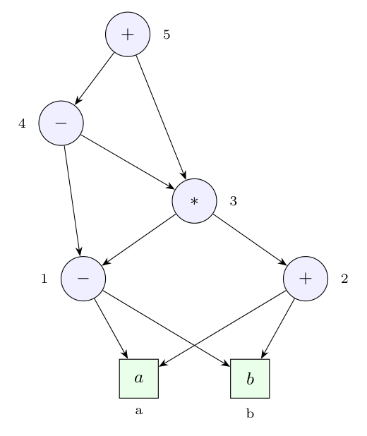

Fully parenthesized expression, with $X = (a - b)$ and $Y = (a + b)$:

$$(X - (X * Y)) + (X * Y)$$

(The grammar is taken as the usual expression grammar; the printed one lacks $T \to F$, which is obviously intended.)

**(i) Abstract syntax tree.** One node for every operator occurrence, nothing shared: 9 operator nodes and 10 leaves.



**(ii) DAG.** A node is shared whenever the same operator is applied to the same children (value-number method, Dragon book sec. 6.1.2):

| Node | Operation | Left | Right |
|:-:|:-:|:-:|:-:|
| 1 | $a - b$ | `a` | `b` |
| 2 | $a + b$ | `a` | `b` |
| 3 | $*$ | 1 | 2 |
| 4 | $-$ | 1 | 3 |
| 5 | $+$ | 4 | 3 |

The sub-expression $a - b$ (node 1) is used three times and $(a-b)*(a+b)$ (node 3) twice, but each is built once.



**(iii) Three-address code for the AST** (post-order, one statement for every operator node, 9 temporaries):

```text
t1 = a - b
t2 = a - b
t3 = a + b
t4 = t2 * t3
t5 = t1 - t4
t6 = a - b
t7 = a + b
t8 = t6 * t7
t9 = t5 + t8
```

**(iv) Three-address code for the DAG** (one statement per DAG node, 5 temporaries):

```text
t1 = a - b
t2 = a + b
t3 = t1 * t2
t4 = t1 - t3
t5 = t4 + t3
```

The DAG saves 4 statements (and 4 temporaries): `a - b` is computed once instead of three times, `a + b` once instead of twice, and `(a-b)*(a+b)` once instead of twice.
