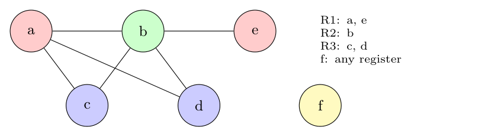

**Global register allocation.** The simple code generator keeps values in registers only inside one basic block and stores them at its end. **Global** allocation assigns registers to variables **across basic blocks** (usually for the duration of a loop), so a heavily used variable such as a loop counter stays in a register and the loads and stores in every iteration disappear (Dragon book sec. 8.8).

**Overview of the algorithms.**

*A. Usage-count method (Dragon book sec. 8.8.1-8.8.3).* For an inner loop $L$ and variable $x$, the saving of keeping $x$ in a register for the whole loop is

$$\sum_{B \in L} \big(use(x, B) + 2 \cdot live(x, B)\big)$$

where $use(x, B)$ is the number of uses of $x$ in block $B$ before any definition of $x$ in $B$ (each saves one load), and $live(x, B) = 1$ if $x$ is live on exit from $B$ and is assigned a value in $B$ (it saves a store; the factor 2 reflects the load and store avoided on the loop path). Steps: (1) compute these counts for each variable; (2) give the available registers to the variables with the highest counts; (3) load them in the loop preheader and store them at the loop exits if they were modified; (4) allocate loops from the innermost outwards, since a variable already assigned in an inner loop is not reassigned in the outer one.

*B. Graph colouring (Chaitin).* With $k$ registers:

1. **Build** the register *interference graph*: a node per variable (live range); an edge joins two variables that are live at the same time.
2. **Simplify**: repeatedly remove a node with fewer than $k$ neighbours and push it on a stack (it can always be coloured later).
3. If every remaining node has $\ge k$ neighbours, choose one to **spill** (lowest cost, e.g. rarely used), remove it and continue; the spilled variable lives in memory.
4. **Select**: pop the nodes in reverse order and give each a register different from its coloured neighbours.

**Example.** Code: `a = ...; b = ...; c = a + b; d = c * 2; e = a + d; f = b + e; print f`. Interference edges (variables live together): $a$–$b$, $a$–$c$, $b$–$c$, $a$–$d$, $b$–$d$, $b$–$e$.

- With $k = 3$: remove $f$ (degree 0), $e$ (1), $c$ (2), $d$ (2), then $a$, $b$; colouring in reverse gives $b = R2$, $a = R1$, $d = R3$, $c = R3$, $e = R1$, $f$ any register. **No spill is needed.**
- With $k = 2$: $f$ and $e$ are removed, but then $a, b, c, d$ all have degree $\ge 2$ (a triangle $a, b, c$ exists, so 2 colours cannot suffice); one variable (e.g. $a$) is **spilled** to memory, and the rest can be coloured with two registers.

*Check:* a script searched all assignments: this graph has a 3-colouring (a, e: R1; b: R2; c, d: R3; f: R1) and no 2-colouring.
