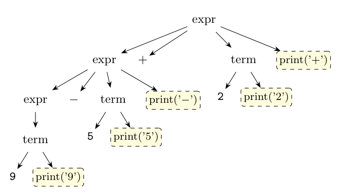

**General strategy** (Dragon book sec. 5.4.3). An SDT embeds semantic actions in the production bodies; the action is executed at the point where it appears. To implement any SDT (whether the underlying grammar is LL or LR):

1. **Parse** the input using the underlying grammar, *ignoring the actions*, and build the **parse tree**.
2. Examine each interior node $N$ with production $A \to \alpha$. Add **extra children** to $N$ for the actions in $\alpha$, so that the children of $N$, from left to right, are exactly the grammar symbols and actions of $\alpha$ in their order.
3. Perform a **preorder (depth-first, left-to-right) traversal** of the tree; as soon as a node labeled by an action is visited, **perform that action**.

(Special cases avoid building the tree: a *postfix SDT* has all actions at the right ends of the bodies and can run in an LR parser on each reduction; an SDT for an L-attributed definition can run during LL or LR parsing, Sec. 5.4.2-5.4.5.)

**Example: infix to postfix.** SDT:

$$expr \to expr_1 + term\ \{print('+')\}$$

$$expr \to expr_1 - term\ \{print('-')\}$$

$$expr \to term$$

$$term \to 0\ \{print('0')\} \mid 1\ \{print('1')\} \mid \ldots \mid 9\ \{print('9')\}$$

Input $9-5+2$. Step 1 gives the parse tree, step 2 adds the action nodes (shown dashed), step 3 visits the tree in preorder and executes the actions as it meets them:

Executing the actions from left to right: `print('9')`, `print('5')`, `print('-')`, `print('2')`, `print('+')`, so the output is **`95-2+`**, the postfix form of $9-5+2$.
