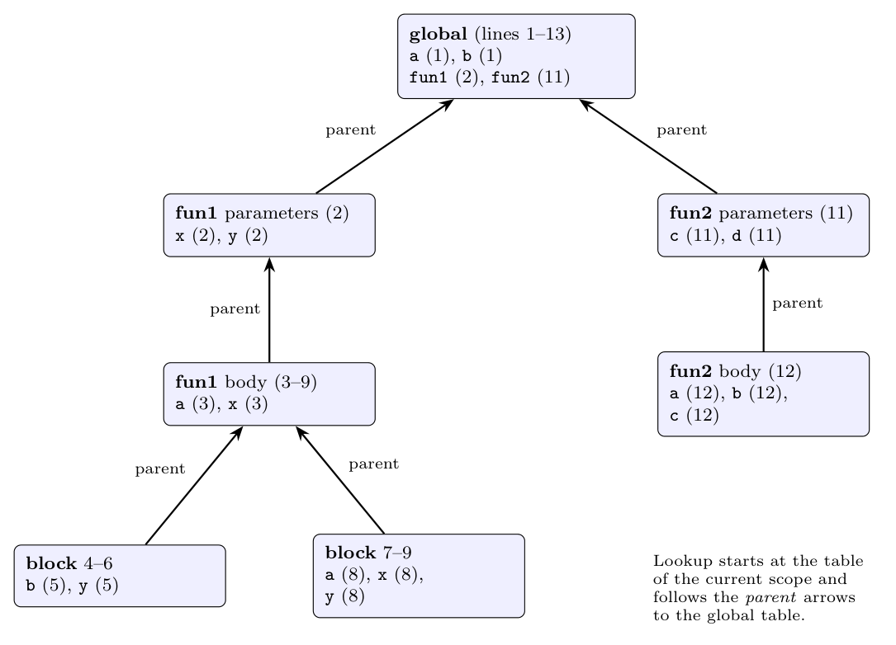

**Assumptions.** The printed code is read as the usual nested-scope program, with the `{` on line 10 closing the body of `fun1` (a `}` was clearly intended there). Parameters form an outer scope of the function body, so `int a,x;` on line 3 (and `int a, b, c;` on line 12) *shadow* the global `a` and the parameters of the same name instead of redeclaring them.

**Spaghetti stack (tree of symbol tables).** Each scope has its own table; a table has a pointer to the table of the enclosing scope (its *parent*). The stack of "currently open" tables is a path from a leaf to the root. When a scope is closed, its table is not destroyed (it may be needed by later phases), the current pointer simply moves back to the parent. A name is looked up in the current table first, then along the parent pointers to the root; the entry found first is the one in the innermost enclosing scope.

| Scope (lines) | Entries (declaration line in brackets) | Parent |
|:--|:--|:--|
| global (1-13) | `a` (1), `b` (1), `fun1` (2), `fun2` (11) | none |
| `fun1` parameters | `x` (2), `y` (2) | global |
| `fun1` body (3-9) | `a` (3), `x` (3) | `fun1` parameters |
| block (4-6) | `b` (5), `y` (5) | `fun1` body |
| block (7-9) | `a` (8), `x` (8), `y` (8) | `fun1` body |
| `fun2` parameters | `c` (11), `d` (11) | global |
| `fun2` body (12) | `a` (12), `b` (12), `c` (12) | `fun2` parameters |

**Example lookups.** Inside the block on lines 4-6: `b` and `y` are found in the block's own table (line 5); `x` is found in the parent `fun1` body (line 3); `a` in `fun1` body (line 3, not the global `a`). Inside the block on lines 7-9: `a`, `x`, `y` are all local (line 8). Inside `fun2` body, `d` is found one level up (line 11) and `fun1` two levels up in the global table (line 2).
