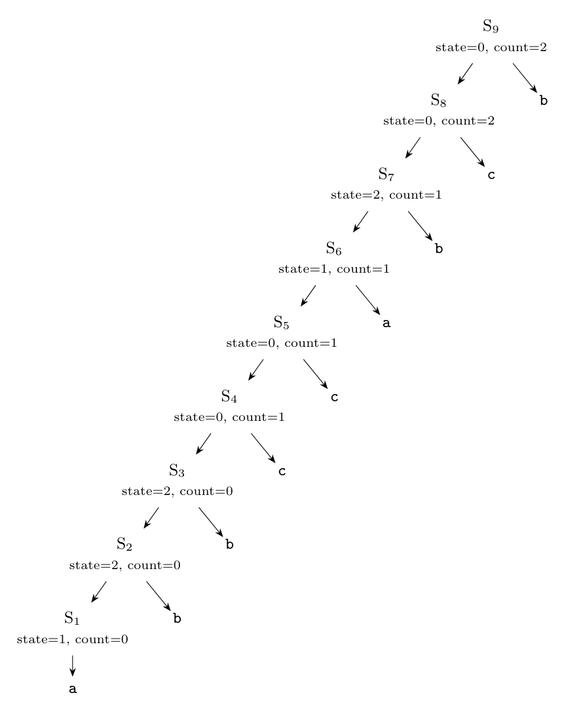

**Idea.** The grammar $S \to Sa \mid Sb \mid Sc \mid a \mid b \mid c$ generates every non-empty string over $\{a, b, c\}$ with the string built from left to right ($S \to S_1\ x$ appends the character $x$). So we simulate a small DFA for the language $ab^+c$ with a synthesized attribute $S.state$ and count the completed matches in $S.count$:

| $state$ | meaning for the string read so far |
|:-:|:--|
| 0 | the suffix cannot start a match (e.g. empty, or ends with `c`, or `b` not preceded by `a b*`) |
| 1 | the suffix is `a` |
| 2 | the suffix is `a b`$^+$ |

Transitions: on `a` go to 1 from any state; on `b` go to 2 if the state is 1 or 2, else to 0; on `c` a match is completed iff the state is 2 (count it), and the state returns to 0.

**Attribute grammar** (both attributes synthesized):

| Production | Semantic rules |
|:--|:--|
| $S \to S_1\ a$ | $S.state = 1;\ S.count = S_1.count$ |
| $S \to S_1\ b$ | $S.state = (S_1.state \ge 1)\ ?\ 2 : 0;\ S.count = S_1.count$ |
| $S \to S_1\ c$ | $S.count = S_1.count + (S_1.state == 2\ ?\ 1 : 0);\ S.state = 0$ |
| $S \to a$ | $S.state = 1;\ S.count = 0$ |
| $S \to b$ | $S.state = 0;\ S.count = 0$ |
| $S \to c$ | $S.state = 0;\ S.count = 0$ |

The answer for the whole input is $count$ of the root. (Each occurrence of $ab^+c$ ends at a different `c`, and a `c` completes at most one occurrence, so counting at the `c` is exact.) It is an S-attributed definition, so it can be evaluated bottom-up.

**Annotated parse tree for `abbccabcb`.** The tree is left-deep, $S_k$ being the node that covers the first $k$ characters:

| $k$ | input read | state | count |
|:-:|:--|:-:|:-:|
| 1 | `a` | 1 | 0 |
| 2 | `ab` | 2 | 0 |
| 3 | `abb` | 2 | 0 |
| 4 | `abbc` | 0 | 1 |
| 5 | `abbcc` | 0 | 1 |
| 6 | `abbcca` | 1 | 1 |
| 7 | `abbccab` | 2 | 1 |
| 8 | `abbccabc` | 0 | 2 |
| 9 | `abbccabcb` | 0 | 2 |

The root has $S.count = \mathbf{2}$ (the matches `abbc` and `abc`), as required.

*Check:* the attribute values were computed by a script and compared with a regular-expression count (`ab+c` occurs twice).
