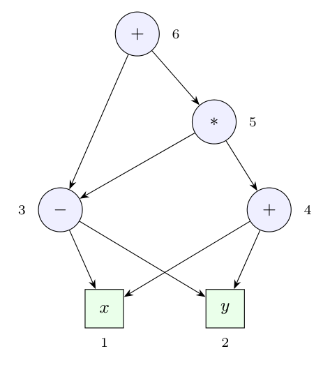

Fully parenthesized with usual precedence: $x - y + (x - y) * (x + y) = (x - y) + \big((x - y) * (x + y)\big)$.

A **DAG** shares a node whenever the same operator is applied to the same operands, so the common sub-expression $x - y$ is a single node. Constructing it with the **value-number method** (Dragon book sec. 6.1.2), each new `(op, left, right)` is looked up before a node is created:

| Value number | Node | Operation | Left | Right |
|:-:|:--|:-:|:-:|:-:|
| 1 | leaf $x$ | | | |
| 2 | leaf $y$ | | | |
| 3 | $x - y$ | $-$ | 1 | 2 |
| 4 | $x + y$ | $+$ | 1 | 2 |
| 5 | $(x - y) * (x + y)$ | $*$ | 3 | 4 |
| — | second $x - y$ | found: **node 3 is reused** | | |
| 6 | whole expression | $+$ | 3 | 5 |

The DAG has 6 nodes (2 leaves, 4 operators) instead of 11 nodes in the syntax tree; node 3 ($x - y$) has two parents (nodes 5 and 6), and the leaves $x$, $y$ have two parents each (nodes 3 and 4).
