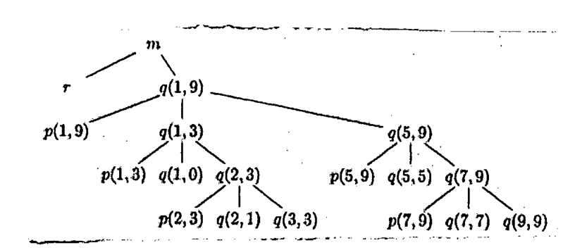

Notice the following activation tree.



*The tree, as drawn:*

```text
m
+-- r
+-- q(1,9)
    +-- p(1,9)
    +-- q(1,3)
    |   +-- p(1,3)
    |   +-- q(1,0)
    |   +-- q(2,3)
    |       +-- p(2,3)
    |       +-- q(2,1)
    |       +-- q(3,3)
    +-- q(5,9)
        +-- p(5,9)
        +-- q(5,5)
        +-- q(7,9)
            +-- p(7,9)
            +-- q(7,7)
            +-- q(9,9)
```

When q(3,3) is being run by the processor,

(i) What are the live activations?

(ii) What activations have already been processed?
