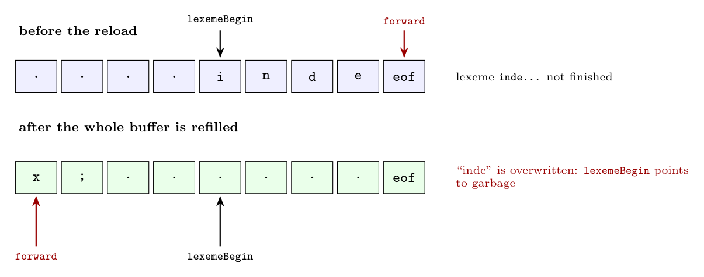

**Buffer pair (for reference).** Two halves of $N$ characters each. `lexemeBegin` marks the start of the current lexeme and `forward` scans ahead. When `forward` reaches the end of one half, the **other** half is reloaded. The half that holds the start of the lexeme is untouched, so any lexeme of up to $N$ characters survives.

**Single buffer with the same two pointers:**

What would happen:

1. When `forward` reaches the end of the single buffer in the middle of a lexeme (e.g. the identifier `index`), the buffer must be refilled to continue. Refilling overwrites the **beginning of the current lexeme**, which `lexemeBegin` still points to. The lexeme `index` can no longer be assembled: it is lost or corrupted.
2. If `forward` has read one character too far and must **retract** across the reload point, that character is gone too.
3. To avoid this, the lexer would have to copy the partial lexeme (from `lexemeBegin` to the end) to the front of the buffer before every reload. That is extra work and makes the maximum lexeme length depend on where the lexeme happens to start in the buffer.

**Can sentinels change the scenario? No, not this problem.** A sentinel (`eof` at the end of the buffer) only makes the end-of-buffer test cheaper: instead of two tests per character (end of buffer? which character?), one comparison with `eof` handles both, and a real `eof` is distinguished from the buffer-end sentinel by position. The sentinel tells the lexer *when* to reload, but does not provide a place to keep the old lexeme. Overwriting the lexeme is prevented only by a second buffer half, or by copying. Sentinels improve **speed**; buffer pairs provide **safety** for lexemes and lookahead.
