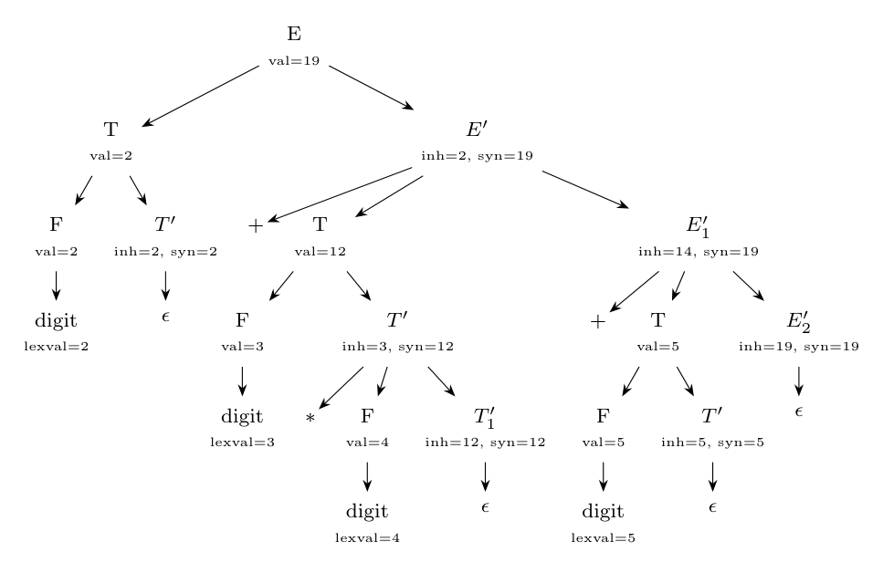

Using the SDD of 5(a). Attribute values are shown at each node (`inh` = inherited, `syn` = synthesized, `val` = value).

**Order of evaluation** (a topological order of the dependency graph):

1. Leftmost term: $F.val = 2$, $T'.inh = 2$, $T'.syn = 2$, $T.val = 2$. Then $E'.inh = T.val = 2$.
2. Second term: $F.val = 3$, $T'.inh = 3$; $F.val = 4$, $T_1'.inh = 3 \times 4 = 12$, $T_1'.syn = 12$, $T'.syn = 12$, $T.val = 12$. Then $E_1'.inh = 2 + 12 = 14$.
3. Third term: $T.val = 5$. Then $E_2'.inh = 14 + 5 = 19$.
4. $E_2' \to \epsilon$: $E_2'.syn = 19$, copied up: $E_1'.syn = 19$, $E'.syn = 19$, $E.val = 19$.

**Result: 19**, which is $2 + (3 \times 4) + 5$.
