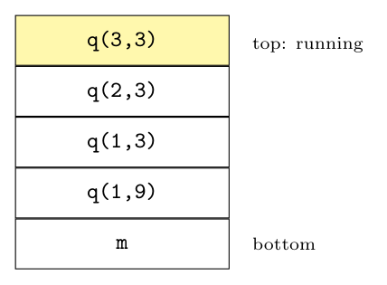
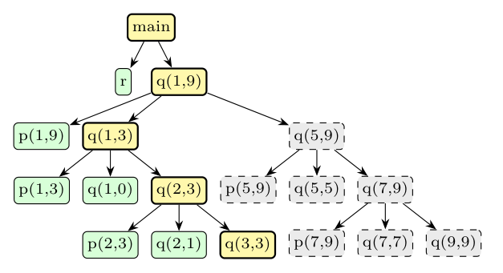

**Assumptions.** As in any activation tree, the children of a node are the calls it makes, in order from left to right, and a call ends before the next sibling starts (this is the textbook's quicksort activation tree). `m` is the main program.

**Key facts about activation trees.** The sequence of calls is a preorder traversal of the tree, and the sequence of returns is a postorder traversal. When control is in a particular activation, the **live** activations are exactly that node and its ancestors, which are the activation records on the control stack.

**(i) Live activations when q(3,3) is running:** the path from the root to q(3,3):

$$m,\ q(1,9),\ q(1,3),\ q(2,3),\ q(3,3)$$

**(ii) Activations already processed (completed):** every node visited before q(3,3) in preorder that is not one of its ancestors, i.e. all nodes to the left of the path:

- r (read the array, first child of m);
- p(1,9) (partition, first child of q(1,9));
- p(1,3), q(1,0) (first two children of q(1,3));
- p(2,3), q(2,1) (first two children of q(2,3)).

So **r, p(1,9), p(1,3), q(1,0), p(2,3), q(2,1)** have finished. The whole right subtree q(5,9), p(5,9), q(5,5), q(7,9), p(7,9), q(7,7), q(9,9) has **not started** yet.

