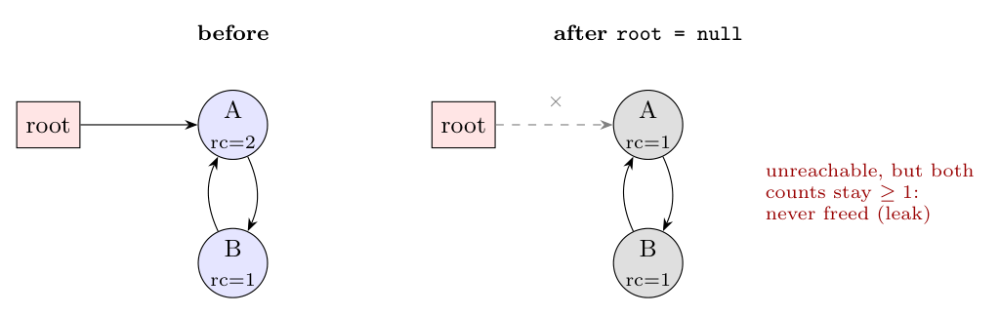

**Reference counting** keeps, in each object, a count of the references pointing to it. The count is incremented when a reference to the object is created, and decremented when a reference is removed or overwritten. When the count becomes 0, the object is garbage and is freed immediately; the counts of the objects it points to are then decremented.

**The core problem: it cannot collect cyclic garbage (unreachable cycles).** If a group of objects point to each other in a cycle, each of them always has a count of at least 1 from the others, even after the whole group has become unreachable from the root set. Their counts never reach 0, so they are **never reclaimed**: a memory leak.

**Example:**

1. Initially the root points to A, A points to B, and B points back to A. So count(A) = 2 and count(B) = 1.
2. The program sets the root pointer to null, and count(A) drops to 1.
3. Now A and B are unreachable, but count(A) = 1 (from B) and count(B) = 1 (from A). Neither reaches 0, so neither is freed.

(Doubly linked lists and trees with parent pointers create such cycles all the time.) Reference counting also has a run-time cost on every pointer assignment. Cycles must be handled by a separate trace-based collector run occasionally, or by weak references.
