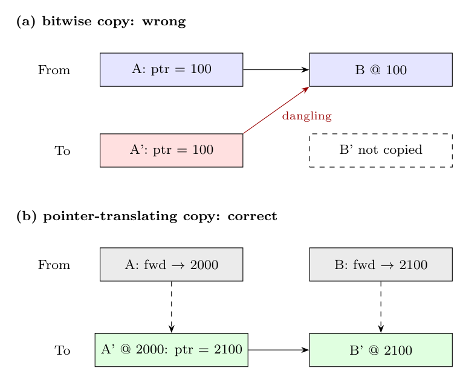

**Why a bitwise copy is not enough.** A stop-and-copy (copying) collector **relocates** objects: each live object is copied from the From space (or a young generation) to a new address in the To space (or an older generation). A plain bitwise copy reproduces the object's fields exactly, including its **pointer fields**, which still hold the **old addresses** in From space. Also, other objects, the root set and objects in **older generations** that point to the moved object still hold its old address. After the collection, From space is reused, so all these pointers would be dangling.

**How it is handled:**

1. **Forwarding addresses (NewLocation).** When an object is copied, its new address is recorded in the old copy (`NewLocation(o)`). Whenever another reference to `o` is found later, the collector sees that `o` was already copied and uses the forwarding address instead of copying again. This keeps sharing and cycles intact.
2. **Scanning and translating pointers.** Every copied object is **scanned** (Cheney's `unscanned` pointer). Each pointer field `o.r` is replaced by `LookupNewLocation(o.r)`, which copies the target if necessary and returns its new address. The root set is translated the same way.

3. **Generational collectors: the remembered set.** When only the young generation is collected, pointers from **older generations into the young one** must also be found and updated, without scanning the whole old generation. A **write barrier** records every store that creates such a pointer in a **remembered set**. During a minor collection, these entries are treated as extra roots, and after the young objects are moved, the pointers in the old generation are updated to the new addresses.

So copying collection must be a **pointer-translating** copy, not a raw memory copy.
