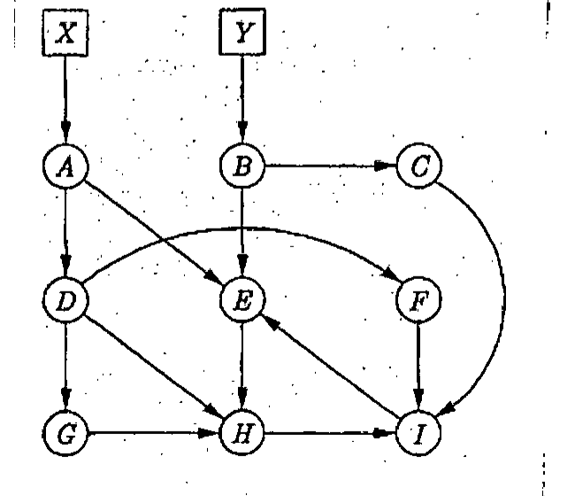

Each garbage collection algorithm starts with a root set. Which objects constitute the root set? Consider the network of objects in Figure 7(d). Show the steps of a mark-and-sweep garbage collector on this network with the pointer $A \to D$ deleted. Assume X and Y are members of the root set. What is the primary difference between basic mark-and-compact and Cheney's copying collector algorithms?

