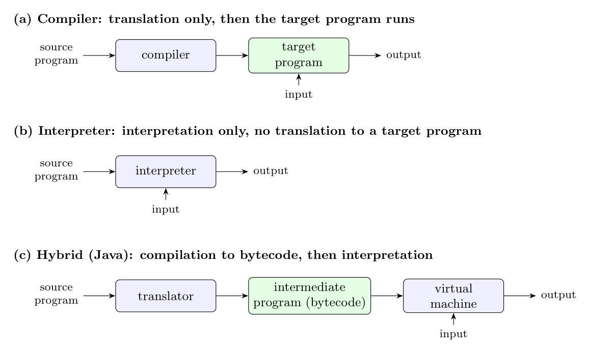

- A **compiler** translates the whole source program into an equivalent **target program**. When the target is the **machine language** of the computer, the CPU can execute it directly: the user just runs the target program on its input.
- An **interpreter** does not produce a target program. It executes the operations of the source program (or an intermediate code) directly on the input, statement by statement.
- Some compilers produce code for a **virtual machine** rather than a real one. Java's `javac` produces bytecode, which no CPU executes natively. It needs an interpreter (the JVM, possibly with a JIT compiler) to run it. Scripting languages (Python, shell scripts) are likewise executed by an interpreter.

So whether code runs directly depends on whether it is the machine language of the real processor (direct execution) or a source/intermediate form that only an interpreter or virtual machine understands. Machine code is faster; interpreted code is more portable and gives better error diagnostics.

