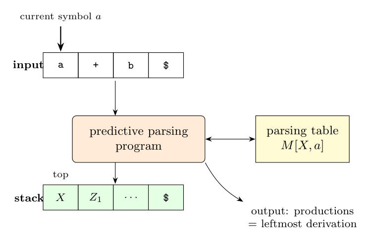

**Parser:** stack (initially `S $`), input `w$`, table $M$. With $X$ on top and lookahead $a$:

- if $X = a$: pop and advance (match);
- if $X$ is a nonterminal and $M[X, a] = X \to Y_1 \ldots Y_k$: output it, pop $X$, push $Y_k \ldots Y_1$ ($Y_1$ on top);
- otherwise: error.

**Invariant:** at every step,

$$\text{(matched input)} \cdot \text{(stack, top to bottom, without \$)}$$

is a left-sentential form, $S \underset{lm}{\overset{*}{\Rightarrow}} w\alpha$.

- *Initially:* $\epsilon \cdot S = S$. True.
- *Match step:* a terminal moves from the top of the stack to the matched input, so the concatenation is unchanged.
- *Expand step:* the form is $w X \gamma$. Since $w$ is all terminals, $X$ is the **leftmost nonterminal**. Replacing it by $Y_1 \ldots Y_k$ in the same order (that is why the body is pushed in reverse) gives $w Y_1 \ldots Y_k \gamma$. This is exactly the step $wX\gamma \underset{lm}{\Rightarrow} wY_1 \ldots Y_k\gamma$.

So each **table entry used** is one step of the leftmost derivation, and the stack always holds the not-yet-derived suffix of the current left-sentential form.

**Example** ($E \to TE'$, $E' \to +TE' \mid \epsilon$, $T \to FT'$, $T' \to *FT' \mid \epsilon$, $F \to (E) \mid \textbf{id}$), input `id + id`:

| Matched | Stack | Input | Table entry used |
|:--|:--|--:|:--|
| | $E$\$ | id+id\$ | $M[E,\text{id}] = E \to TE'$ |
| | $TE'$\$ | id+id\$ | $M[T,\text{id}] = T \to FT'$ |
| | $FT'E'$\$ | id+id\$ | $M[F,\text{id}] = F \to \textbf{id}$ |
| | id$T'E'$\$ | id+id\$ | match |
| id | $T'E'$\$ | +id\$ | $M[T',+] = T' \to \epsilon$ |
| id | $E'$\$ | +id\$ | $M[E',+] = E' \to +TE'$ |
| id | $+TE'$\$ | +id\$ | match |
| id+ | $TE'$\$ | id\$ | $T \to FT'$ |
| id+ | $FT'E'$\$ | id\$ | $F \to \textbf{id}$ |
| id+ | id$T'E'$\$ | id\$ | match |
| id+id | $T'E'$\$ | \$ | $T' \to \epsilon$ |
| id+id | $E'$\$ | \$ | $E' \to \epsilon$ |
| id+id | \$ | \$ | accept |

The column "matched + stack" reads $E$, $TE'$, $FT'E'$, id $T'E'$, id $E'$, id $+TE'$, ...: the left-sentential forms of

$$E \underset{lm}{\Rightarrow} TE' \underset{lm}{\Rightarrow} FT'E' \underset{lm}{\Rightarrow} \textbf{id}\,T'E' \underset{lm}{\Rightarrow} \textbf{id}\,E' \underset{lm}{\Rightarrow} \ldots$$
