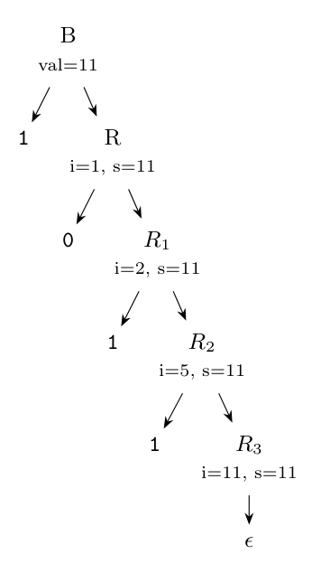

**Idea.** The left-recursive grammar $B \to B\,0 \mid B\,1 \mid 1$ generates a leading `1` followed by any string of 0s and 1s. In the right-recursive form

$$B \to 1\,R, \qquad R \to 0\,R \mid 1\,R \mid \epsilon$$

the value can no longer be synthesized from the left part. Instead, pass the **value of the prefix read so far** down as an inherited attribute `R.i`, and pass the final value back up in a synthesized attribute `R.s` (KMS slides / Dragon 5.4.4: "a value computed by the left-recursive rules is handed down through an inherited attribute").

**SDT:**

$$B \to 1\ \{R.i = 1;\}\ R\ \{B.val = R.s;\}$$

$$R \to 0\ \{R_1.i = 2 \times R.i;\}\ R_1\ \{R.s = R_1.s;\}$$

$$R \to 1\ \{R_1.i = 2 \times R.i + 1;\}\ R_1\ \{R.s = R_1.s;\}$$

$$R \to \epsilon\ \{R.s = R.i;\}$$

Each action that computes an inherited attribute of $R_1$ is placed just before $R_1$, and each synthesized-attribute action at the end of its body, so the SDT is L-attributed and works in a top-down parse.

**Check with `1011` (= 11):**

| Expansion | Inherited `R.i` |
|:--|:--|
| $B \to 1\,R$ | $R.i = 1$ |
| $R \to 0\,R_1$ | $R_1.i = 2 \times 1 = 2$ |
| $R_1 \to 1\,R_2$ | $R_2.i = 2 \times 2 + 1 = 5$ |
| $R_2 \to 1\,R_3$ | $R_3.i = 2 \times 5 + 1 = 11$ |
| $R_3 \to \epsilon$ | $R_3.s = 11$, copied up: $B.val = 11$ |

The original SDT gives the same value: $((1 \times 2 + 0) \times 2 + 1) \times 2 + 1 = 11$.
