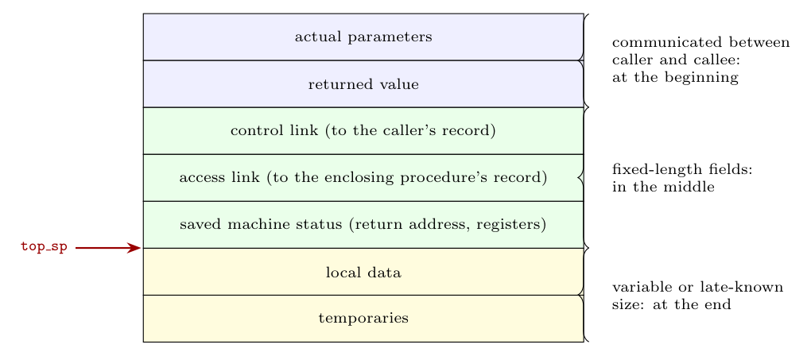

**Activation record.** Each call (activation) of a procedure needs storage for its parameters, local variables and bookkeeping information. This block of storage is the **activation record** (or frame). In a language with stack allocation, an activation record is pushed on the control stack when the procedure is called and popped when it returns. The record of the currently running procedure is on top.

**Data usually stored** (a typical layout, from the caller's side down):

| Field | Contents |
|:--|:--|
| Actual parameters | Values supplied by the caller (often passed in registers when possible) |
| Returned value | Space for the value the callee returns (also often a register) |
| Control link | Points to the activation record of the **caller** |
| Access link | Points to the record of the lexically enclosing procedure, to reach non-local data (needed in languages with nested procedures) |
| Saved machine status | Return address (value of the program counter to return to) and the contents of registers to be restored |
| Local data | The procedure's local variables |
| Temporaries | Intermediate values of expressions, e.g. those that could not be kept in registers |

Not every language or compiler uses every field; for example, C needs no access links.
