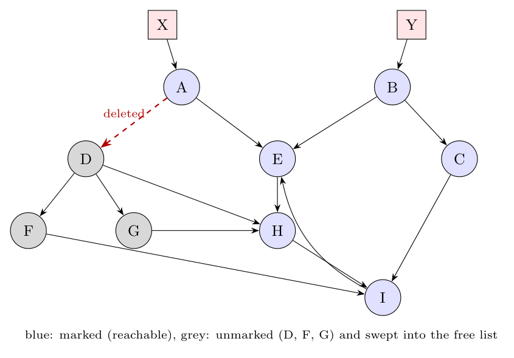

**Root set (2 marks).** The data that the program can access **directly, without dereferencing any pointer**: static (global) variables, the variables and temporaries in the activation records on the run-time stack, and the machine registers. In the figure, $X$ and $Y$ are the roots. Every object reachable from them by following pointers is live.

**Assumptions.** The edges are read from the figure: X $\to$ A, Y $\to$ B, A $\to$ D (deleted), A $\to$ E, B $\to$ C, B $\to$ E, C $\to$ I, D $\to$ F, D $\to$ G, D $\to$ H, E $\to$ H, F $\to$ I, G $\to$ H, H $\to$ I, I $\to$ E. The unscanned list is processed first-in first-out, adding newly reached objects in alphabetical order. The heap holds the nine objects A-I.

**Mark-and-sweep (8 marks), basic algorithm of the text:**

*Mark phase:* set the reached-bit of the objects referenced by the roots, put them on the *Unscanned* list, then repeatedly remove an object and mark and add its unmarked children.

| Step | Object scanned | Its references | Newly marked | Unscanned list after |
|:-:|:--|:--|:--|:--|
| 0 | (roots X, Y) | A, B | A, B | A, B |
| 1 | A | E (A $\to$ D deleted) | E | B, E |
| 2 | B | C, E | C | E, C |
| 3 | E | H | H | C, H |
| 4 | C | I | I | H, I |
| 5 | H | I (already marked) | none | I |
| 6 | I | E (already marked) | none | empty |

Marked (reachable): **A, B, C, E, H, I**.

*Sweep phase:* scan the whole heap chunk by chunk.

- Unmarked objects **D, F, G** are added to the free list. D is no longer pointed to by A; F and G were reachable only through D. The fact that D, F and G still point to other objects does not matter, because they themselves are unreachable.
- The reached-bits of A, B, C, E, H and I are reset to 0 for the next collection.

**Mark-and-compact vs Cheney's copying collector (5 marks).** The primary difference is **where the live objects go**:

- **Basic mark-and-compact** works **in place**, in one heap. After marking, it scans the heap to compute new addresses, updates all pointers, and slides the live objects to the low end of the same heap. It needs no extra space, but makes several passes over the whole heap, and its cost is proportional to the heap size plus the size of the live data.
- **Cheney's copying collector** divides the heap into two **semispaces** and copies the live objects from the From space into the empty To space in one breadth-first pass, then swaps the roles. It never touches garbage, so its cost is proportional only to the live data. However, only half of the memory can be used at any time.
