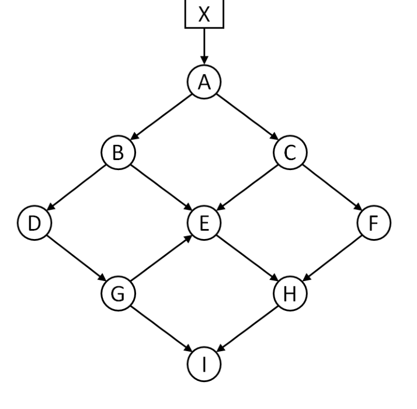

Consider the network of objects below. Suppose at some point in time, the pointer $A \to C$ is deleted. Then we perform a mark-and-compact garbage collector on the network. Also, suppose that,

i. Each object has size 50 bytes, and

ii. Initially, all the nine objects in the heap are arranged in alphabetical order, starting at byte 0 of the heap.

What is the address of each object after garbage collection? Draw the heap showing locations of the allocated objects before and after running garbage collection.

