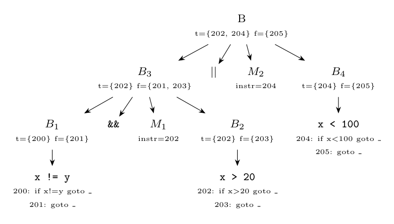

**Assumptions.** The operator printed as "II" is `||`. The scheme of Q12(a) is used, and the first instruction generated gets the number 200. The true and false exits of the whole expression are left unfilled (they are filled by the enclosing statement).

`&&` has higher precedence, so the expression is $(x \ne y\ \&\&\ x > 20) \Vert x < 100$. Call the parts $B_1$: `x != y`, $B_2$: `x > 20`, $B_3 = B_1\ \&\&\ M_1\ B_2$, $B_4$: `x < 100`, $B = B_3 \Vert M_2\ B_4$.

**Reductions in order** (bottom-up):

| Reduction | Code generated | Attributes |
|:--|:--|:--|
| $B_1 \to x \ne y$ | 200: `if x != y goto _`; 201: `goto _` | $B_1.t = \{200\}$, $B_1.f = \{201\}$ |
| $M_1 \to \epsilon$ | | $M_1.instr = 202$ |
| $B_2 \to x > 20$ | 202: `if x > 20 goto _`; 203: `goto _` | $B_2.t = \{202\}$, $B_2.f = \{203\}$ |
| $B_3 \to B_1\ \&\&\ M_1 B_2$ | backpatch({200}, 202) | $B_3.t = \{202\}$, $B_3.f = \{201, 203\}$ |
| $M_2 \to \epsilon$ | | $M_2.instr = 204$ |
| $B_4 \to x < 100$ | 204: `if x < 100 goto _`; 205: `goto _` | $B_4.t = \{204\}$, $B_4.f = \{205\}$ |
| $B \to B_3 \Vert M_2 B_4$ | backpatch({201, 203}, 204) | $B.t = \{202, 204\}$, $B.f = \{205\}$ |

**Annotated parse tree:**



**Resulting code:**

```text
200: if x != y goto 202
201: goto 204
202: if x > 20 goto _
203: goto 204
204: if x < 100 goto _
205: goto _
```

Instructions 202 and 204 (the true list) and 205 (the false list) are still to be backpatched by the statement that contains the expression.
