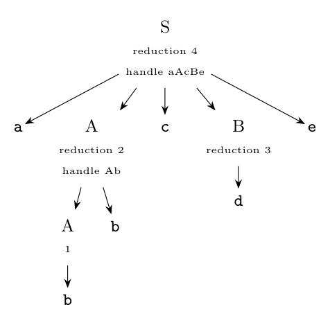

**Handle.** A handle of a right-sentential form $\gamma$ is a production $A \to \beta$ together with a position in $\gamma$ where $\beta$ occurs, such that replacing $\beta$ by $A$ gives the previous right-sentential form in a **rightmost** derivation:

$$S \overset{*}{\underset{rm}{\Rightarrow}} \alpha A w \underset{rm}{\Rightarrow} \alpha\beta w$$

Informally, it is the substring that must be reduced next. The string $w$ to its right contains only terminals.

**Rightmost derivation of `abbcde`:**

$$S \underset{rm}{\Rightarrow} aAcBe \underset{rm}{\Rightarrow} aAcde \underset{rm}{\Rightarrow} aAbcde \underset{rm}{\Rightarrow} abbcde$$

**Handles (handle pruning):**

| Right-sentential form | Handle | Reducing production |
|:--|:--|:--|
| a b b c d e | b (position 2) | $A \to b$ |
| a A b c d e | A b (positions 2-3) | $A \to Ab$ |
| a A c d e | d (position 4) | $B \to d$ |
| a A c B e | a A c B e | $S \to aAcBe$ |
| S | | |

(In `abbcde`, the second `b` is not a handle: reducing it would give `abAcde`, which is not a right-sentential form.)

**Shift-reduce (LR) parsing:**

| Stack | Input | Action |
|:--|--:|:--|
| \$ | abbcde\$ | shift |
| \$a | bbcde\$ | shift |
| \$ab | bcde\$ | reduce $A \to b$ |
| \$aA | bcde\$ | shift |
| \$aAb | cde\$ | reduce $A \to Ab$ |
| \$aA | cde\$ | shift |
| \$aAc | de\$ | shift |
| \$aAcd | e\$ | reduce $B \to d$ |
| \$aAcB | e\$ | shift |
| \$aAcBe | \$ | reduce $S \to aAcBe$ |
| \$S | \$ | accept |

Each handle appears on top of the stack and is pruned (replaced by the head of its production). The reductions, read bottom-up, are the rightmost derivation in reverse.
