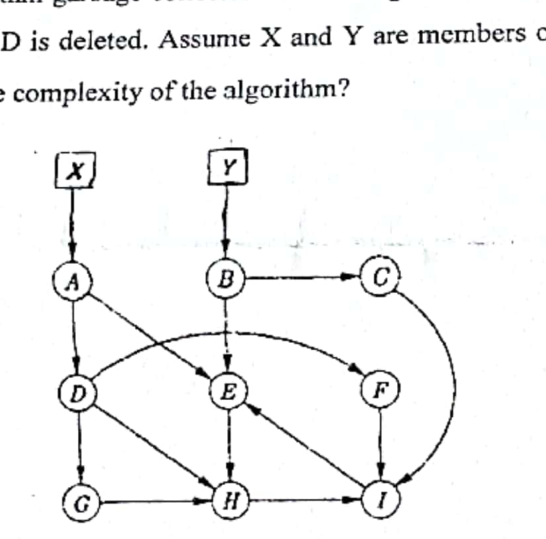

The baker's mark-and-sweep algorithm for garbage collection moves objects among four lists: *Free, Unreached, Unscanned,* and *Scanned*. Illustrate how Baker's mark-and-sweep algorithm garbage collector works using the example network below when the pointer $A \to D$ is deleted. Assume X and Y are members of the root set. What is the time and space complexity of the algorithm?

