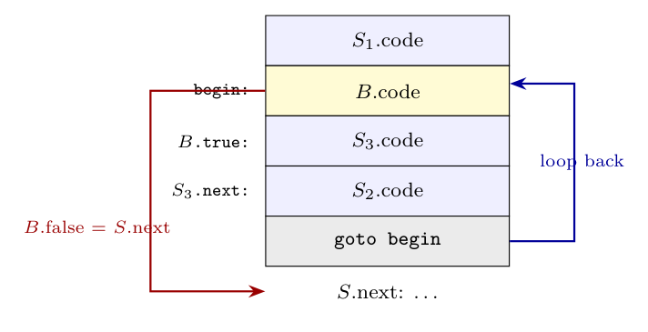

**Assumptions.** The conventions of the text are used: $B$ has inherited labels `B.true` and `B.false`; statements have inherited `next`; `newlabel()` creates a fresh label; `label(L)` attaches $L$ to the next instruction; `||` concatenates code. $S_1$ and $S_2$ are statements (e.g. assignments).

**Layout of the code:**

**SDD:**

| Production | Semantic rules |
|:--|:--|
| $S \to \textbf{for}\ (S_1;\ B;\ S_2)\ S_3$ | $begin = newlabel()$ |
| | $B.true = newlabel()$ |
| | $B.false = S.next$ |
| | $S_1.next = begin$ |
| | $S_3.next = newlabel()$ |
| | $S_2.next = begin$ |
| | $S.code = S_1.code \,\Vert\, label(begin) \,\Vert\, B.code \,\Vert\, label(B.true) \,\Vert\, S_3.code$ |
| | $\qquad \Vert\ label(S_3.next) \,\Vert\, S_2.code \,\Vert\, gen('\text{goto}'\ begin)$ |

**Explanation:**

- After the initialisation $S_1$, control falls into the test at `begin` (so $S_1.next = begin$).
- If $B$ is true, the body $S_3$ runs. When it finishes, including a jump out of its middle (e.g. a nested `if` jumping to $S_3.next$), control reaches the increment $S_2$ at the label $S_3.next$.
- After $S_2$, the `goto begin` repeats the test.
- If $B$ is false, control goes to $S.next$, leaving the loop.
